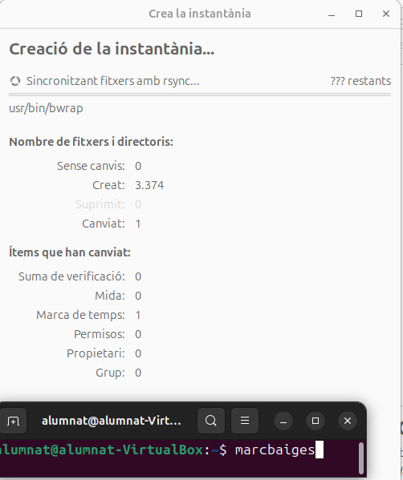

## Virtualització i instal·lació del sistema operatiu Ubuntu
En aquest apartat explicare i realitzare una instal·lació del sistema Ubuntu Desktop on posteriorment instal·lare un Windows 10 com a dual.

L'instal·lació la fare apartir d'una màquina virtual al VirtualBox.
Primer li poso un nom i la iso que ens permetra poder instal·lar l'Ubuntu.

També li assigno la memoria amb 6144MB tindrem prou.

I finalment li he assignat un disc de 80GB ja que em te que sibrar espai per poder instal·lar el Windows posteriorment
Per tant 25GB son per Ubuntu Desktop.

Ara ja puc iniciar la màquina i començar la instal·lació.

Seguim amb l'instal·lació.

En aquesta part selecciono la segona opció on puc configurar les particions.

Ara li assigno l'arrel del sistema que és la particion més gran que necessita més espai.

Finalment el swap que és important si falla la memoria o no es suficient.

I així queda la taula de particions.

I configuro els últims paràmetres.

I començara la instal·lació.

Un cop instl·lat apagare la màquina i inserire la iso del Windows pero poder instal·larlo.

Ara torno a obrir la màquina prenent f12 per entrar al mode arranc.

I cliquem a la c amb CD-ROOM que és la unitat física que hem inserit del Windows.

I ara ja podre instal·lar el Windows.

En aquest pas selecciono instal·lar Windows avançat per configurar les meves propies particions.

I com podem veure em surt que ja tinc Ubuntu instal·lat i l'espai del disc guardat per poder instal·lar Ubuntu.

I començara la instal·lació.

I esperare a que inicie el windows.

I ara configuro els paràmetres bàsics.

## Llicenciament

### Llicències Creative Commons (CC)

Les llicències Creative Commons són un conjunt de permisos públics que l'autor pot aplicar a una obra per regular-ne la reutilització, adaptació i redistribució. Estan pensades principalment per a continguts creatius i educatius (textos, imatges, vídeo, àudio) i no són la primera opció per a programari.

### Components principals
- **BY (Atribució):** sempre exigeix reconèixer l'autor.  
- **SA (ShareAlike / ComparteixIgual):** les obres derivades han d'usar la mateixa llicència.  
- **NC (NoComercial):** prohibeix l'ús amb finalitats comercials (pot ser ambigu).  
- **ND (NoDerivatives / Sense derivades):** permet compartir només còpies exactes, no adaptacions.  
- **CC0:** renúncia als drets d'autor per intentar situar l'obra en domini públic.

Combinacions habituals: CC BY, CC BY-SA, CC BY-NC, CC BY-ND, CC BY-NC-SA, CC BY-NC-ND (més restrictiva).

### Com funcionen legalment
- L'autor manté els drets d'autor però concedeix permisos públics sota condicions clares.  
- Les llicències són no exclusives i, en general, irrevocables per a les còpies ja publicades.  
- Les versions modernes (p. ex. 4.0) són dissenyades per a aplicabilitat internacional.  
- Cal indicar la llicència de manera visible (text o enllaç) i, si es vol, afegir metadades (RDFa, rel="license") per a detecció automàtica.  
- Per a programari, és preferible usar llicències específiques de codi (GPL, MIT, etc.); CC0 pot ser útil per a dades i obres que es volen alliberar sense condicions.

**Resum:** les CC faciliten la compartició amb condicions configurables; triar la combinació adequada depèn de si es vol permetre adaptacions, ús comercial i/o exigir la mateixa llicència en les derivacions.

## Gestors d'arrencada per a instal·lacions duals

Un gestor d’arrencada és un programa intermediari que s’executa quan encenem l’ordinador i que decideix quin sistema operatiu carregar.

A ubuntu el gestor d'arrencada que ja ve instal·lat és el GRUB.

## BOOT REPAIR

En cas de una posible falla del GRUB o un esborrament total del GRUB, ara explicare com es pot recuperar.
Primer realitzare la prova de fallada borrant la carpeta GRUB.

I ara si reinicio la màquina no enjegara.

Per tant ara tanco la maquina i entrare a paràmetres per inserir la ISO del boot repair.

Un cop dins ens apareixera aquest menú on tindre que seleccionar recommended repair.

Finalment si tot ha funcionat apareixera aquesta pestanya informant de que el GRUB s'ha recuperat i podre reiniciar la màquina i treure la ISO.

I ja torno a tenir la carpeta GRUB.

## SUPERGRUB2

Ara fare la mateixa pràctica pero amb restaurant el GRUB amb la ISO del SUPERGRUB2.

Ara insereixo la ISO.

I enjego la màquina.

Li dono per detectar el metodes de reparació.

Seleccionare el mitja que diu Linux.

I si ha reparat bé s'obrira automàticament la màquina.

Ara instal·lare de nou la carpeta grub, i l'actualitzare.

Reinicio i ja inicia la màquina correctament.

## Punts de restauració
Un punt de restauració és una còpia de l’estat del sistema en un moment concret . Serveix per revertir el sistema a aquest estat si una actualització, instal·lació o error provoca problemes, evitant haver de reinstal·lar tot el sistema.

Timeshift és una molt bona opció per restauracions.

Primer l'he instal·lat.

Ara l'inicio.

Un cop configurat li donarea a crea.

I començara a fer la instantània.

I finalment s'ha realitzat la instantània.

Ara fare la prova de borrar una carpeta existent com la de Baixades i veurem si al iniciar la instantània es restaura.

Ara es reiniciara el sistema

I ja hem recuperat la carpeta.

## Configuració de la xarxa

## MODE GRÀFIC 

En aquest apartat configurare una IP manual amb sortida a internet

Per configurar la xarxa en primera instancia podem veure la configuració a través dels paràmetres a l'opció de xarxa. Des d'aquest punt entrem a les opcions del cablejat per comprovar quina IP tenim i amb el mode manual la podem canviar al nostre gust.
Com podem veure tinc una interfície connectada.

I si accedim podrem veure que té una IP assignada.

Aquesta IP ens la dona VirtualBox, ja que tinc posada la NAT en aquesta interfície.

I ara per fer la prova li he posat una IP manualment 192.168.10.2 i la IP 8.8.8.8 per la resolució de domini cap a internet

I amb la comanda ip a puc comprovar que s'han aplicat els canvis.

## MODE TERMINAL

Desde el fitxer /etc/netplan podem modificar la configuració de xarxa per terminal.

Finalment li dono permisos i faig el netplan apply.

I amb la comanda ip a comprovo que s'han aplicat els canvis.

## TIPUS D'INTERFÍCIES AMB MÀQUINES VIRTUALS

Una breu guia visual per entendre ràpidament els modes de xarxa a VirtualBox: què fan, com funcionen i quan usar-los.

---

### NAT (Network Address Translation) 🌐 
- **Què és:** Mode per defecte. La MV comparteix la connexió d’internet de l'amfitrió.
- **Com funciona:** VirtualBox actua com a router intern i assigna a la MV una IP privada (p. ex. `10.0.2.x`). La MV pot sortir a internet, però no és accessible des d'altres equips externs.
- **Avantatge:** Configuració senzilla i segura per accés sortint.
- **Quan usar-ho:** Quan només necessites que la MV tingui accés a internet sense exposar-la a la xarxa local.

---

### Adaptador pont (Bridged) 🔌 
- **Què és:** La MV es comporta com un equip més a la xarxa física.
- **Com funciona:** Utilitza la mateixa targeta de xarxa que l’amfitrió (Wi‑Fi/Ethernet) i rep una IP del mateix router (p. ex. `192.168.1.x`).
- **Avantatges:** La MV és visible a la xarxa; pots fer ping, connectar-te a serveis (SSH, web), i fer proves reals.
- **Quan usar-ho:** Per provar serveis que han de ser accessibles des d'altres equips de la xarxa local.

---

### Xarxa Interna (Internal Network) 🔒 
- **Què és:** Xarxa privada compartida només entre MVs de VirtualBox.
- **Com funciona:** Les MVs dins la mateixa xarxa interna es poden comunicar entre elles, però no tenen accés a l'amfitrió ni a internet.
- **Avantatge:** Aïllament total respecte a la xarxa exterior.
- **Quan usar-ho:** Quan simules entorns tancats (laboratoris, proves de seguretat, topologies internes).

---

### Xarxa NAT Network (NAT Network) 🔁 
- **Què és:** Variante de NAT que permet comunicació entre diverses MVs i accés a internet.
- **Com funciona:** Crees una xarxa NAT compartida des de la configuració de VirtualBox; les MVs dins d'aquesta xarxa poden comunicar-se entre elles i sortir a internet a través d'un NAT comú.
- **Avantatge:** Combina l'accés sortint a internet amb comunicació interna entre MVs.
- **Quan usar-ho:** Ideal per laboratoris on necessites tant connexió a internet com interconnexió entre màquines (ex.: entorn client‑servidor).

---

Nota ràpida: si dubtes entre "Adaptador pont" i "NAT Network", pensa si la MV ha d'estar visible per la resta de la xarxa física (usa pont) o només necessita comunicar-se amb altres MVs i sortir a internet (usa NAT Network).

## Comandes generals i instal·lacions

Pinning Packet és molt utilitzat en sistemes Linux, aquest ens permet controlar les actualitzacions i instal·lacions de programari, si preferim un altra versió per exemple.

Seguidament realitzare una prova.

Vull instal·lar el redis i amb aquesta comanda puc veure el actual candidat i les versions que estan disponibles.

Com podem veure tinc com a candidat la versió 5:7.0.15-1ubuntu0.24.04.2 i ara prefereixo instal·lar la 5:7.0.15-1build2. 
Per tant creare un fitxer per gestionar el paquet que vull instal·lar.

I aquesta és la configuració.

## PWD 
Aquesta ens mostra el directori actual.

## ls
Ens mostra el contingut del directori.

## ls -l
Ens mostra el contingut del directori juntament amb els permisos i propietaris.

## cd
Ens movem a una carpeta o retrosedim.

## mkdir 
Podem generar carpetes.

## touch

I amb el touch arxius.

## rm 

Amb el rm podem eliminar arxius.

I amb el rm -r carpetes i el seu contingut.

## mv 

Amb el mv podem moure fitxers cap a altres carpetes.

## Update 

Amb l'Update actualitzem la llista de paquets disponibles.

## Upgrade

Amb l'upgrade actualitzem tots el paquets instal·lats a la última versió.

## apt

Amb el apt podem instal·lar paquets.

