En primer lloc he creat la màquina servidor on instal·lare el ldap.

Aquesta màquina la configurare amb Xarxa NAT.


I aquesta és la IP de la màquina.


Un cop dins la màquina he instal·lat els paquets necessaris per instal·lar ldap al servidor.


A continuació ens demana la contrasenya de administració.


Un cop instal·lat iniciare el proces de configuració automàtica de ldap.


Ara li poso un nom al domini en el meu cas marc.com.


I un nom d'organització.


I finalment la contrasenya d'administrador.


Una veada configurat ja puc comprovar amb la comanda slapcat que existeix el servidor slap amb la configuració de nom de domini.


## Fitxers ldif

Ara he creat una nova unitat organitzativa anomenada users dins del domini marc.com.


També he creat el fitxer grup.ldif on afegire un nou grup asocciat a una unitat organitzativa.


I finalment he creat un fitxer usuari.ldif on assigno un nou usuari anomenat alu1 on també li assinare un directori personal. 


## Comandes LDAP

A continuació es detalla l'ús i la gestió del directori LDAP mitjançant les comandes de terminal principals (`ldapadd`, `ldapsearch`, `ldapmodify` i `ldapdelete`), ordenades lògicament:

### 1. ldapadd

Un cop creats els fitxers LDIF, els hem d'afegir al servidor LDAP mitjançant la comanda `ldapadd`:


I ara, mitjançant la comanda `slapcat`, podem comprovar els objectes que s'han creat correctament:

* **Unitat organitzativa:**
  

* **Grup:**
  

* **Usuari:**
  

### 2. ldapsearch

Amb la comanda `ldapsearch` podem fer cerques i consultes dels objectes de la base de dades del servidor LDAP:

* **Cerca de l'usuari `alu1` al domini `marc.com`:**
  En aquest exemple realitzem una cerca de l'usuari per verificar que es mostra correctament:
  

* **Cerca general dels objectes creats al domini `marc.com`:**
  

* **Cerca per a la comprovació de les Unitats Organitzatives (UOs) del domini:**
  

### 3. ldapmodify

Per fer modificacions en els atributs dels objectes existents al directori (com ara canviar contrasenyes), s'utilitza la comanda `ldapmodify` acompanyada d'un fitxer LDIF de modificació.

A continuació, modifiquem la contrasenya de l'usuari `alu1`. Primer creem el fitxer `modify.ldif`:


El contingut d'aquest fitxer per canviar la contrasenya a `marc1234` és el següent:


I finalment, apliquem aquest fitxer de modificació al servidor LDAP:


### 4. ldapdelete

La comanda `ldapdelete` ens permet eliminar objectes directament del directori LDAP sense necessitat de crear cap fitxer LDIF addicional, indicant directament el DN (Distinguished Name) de l'entrada que volem esborrar:


## Unio client al domini

Com he dit abans he configurat la màquina servidor amb Xarxa NAT, per tant el client també el configurare dins de la mateixa Xarxa NAT.


Primer comprobo de fer un ping desde el client al servidor.


Un cop comprobada la xarxa instal·lare el paquet necessari per connectarme del client al servidor.


I ens sortira aquest menú de configuració.
Primer posem la IP del sercidor 10.0.2.15.


Poso el nom del domini al qual em vull connectar que és marc.com


Ens pregunta de sí el ldap necessita de autenticació amb contrasenya direm que sí.


I el compte root de ldap.


Finalment ens demana la contrasenya del servidor.


I ara l'usuari sense privilegis.


I la contrasenya per accedir a la base de dades ldap.


I el hash per defecte que el deixarem en el vaor per defecte que és md5.


També és molt important editar el fitxer nsswitch per garantitzar la autenticació i no la busqueda de fitxer locals per accedir al servidor.


Finalment afegeixo aquesta línia al arxiu common-session per crear el directori home dels usuaris amb umask 022.


I desde el servidor ja puc comprovar que troba l'usuari alu1.


I ara probare d'accedir gràficament.


## CONFIGURACIÓ LDAP ENTORN GRÀFIC

En primer lloc instal·lare al servidor l'eina d'etorn gràfic per configurar ldap.


És necessari instal·lar java per iniciar apache.


Ara estableixo la connexió al servidor amb la IP del servidor.


Poso les dades de autenticació del servidor.


I ja estic connectat al servidor LDAP.


I podem crear nous templates de forma gràfica.


Per exemple una nova UO.


Aquesta forma és molt més sencilla i entenedora per un usuari no expert per tant facilita la manipulació del servidor ldap.


## SERVIDORS NFS

El protocol NFS (Network File System) ens permet compartir directoris i fitxers a través de la xarxa local, de manera que els clients els puguin muntar en el seu sistema com si fossin carpetes locals. L'autenticació en NFS es realitza principalment a nivell de màquina (host), confiant en els equips de la xarxa als quals donem accés. En aquest apartat, veurem la configuració del servidor, de clients Ubuntu i Windows, i finalment com integrar-ho amb LDAP per muntar de forma automàtica els directoris personals (home) dels usuaris del domini.

### 1. Instal·lació del Servidor NFS

Per començar, instal·larem el programari del servidor NFS a la màquina servidor d'Ubuntu. Per fer-ho, actualitzem els repositoris i instal·lem el paquet corresponent:

```bash
sudo apt update
sudo apt install nfs-kernel-server
```

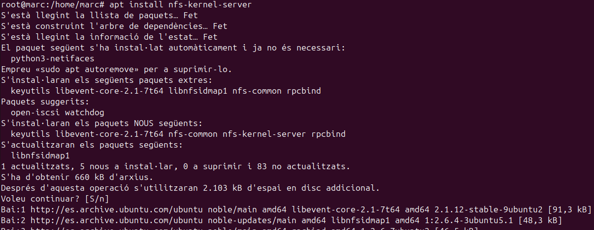

Un cop completada la instal·lació, verifiquem l'estat del servei per assegurar-nos que s'està executant correctament:

```bash
sudo systemctl status nfs-server
```

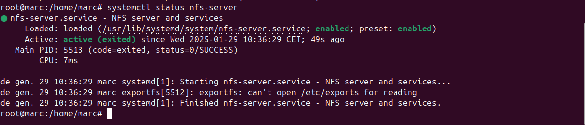

---

### 2. Instal·lació del Client NFS en Ubuntu

A la màquina client amb sistema operatiu Ubuntu, necessitem instal·lar el paquet client per poder muntar els recursos NFS que exporti el servidor:

```bash
sudo apt update
sudo apt install nfs-common rpcbind
```

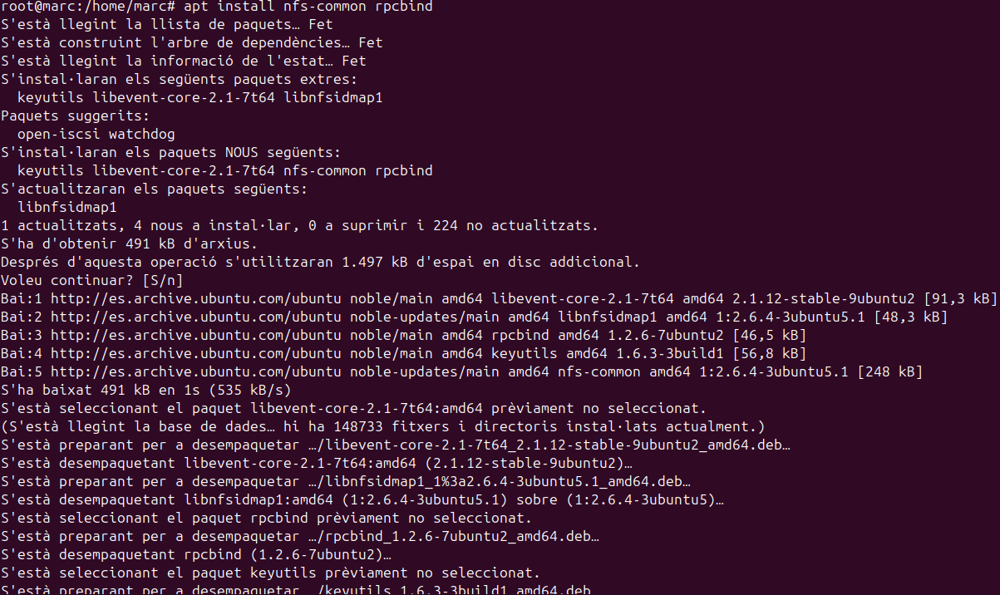

---

### 3. Instal·lació del Client NFS en Windows

Per tal de connectar un client amb sistema operatiu Windows al servidor NFS, hem d'activar la característica corresponent del sistema:

1. Ens dirigim al **Panell de control** > **Programes** > **Programes i característiques**.
2. Al menú de l'esquerra, seleccionem **Activa o desactiva característiques de Windows**.
3. Busquem la branca **Serveis per a NFS** i activem la casella **Client per a NFS**.

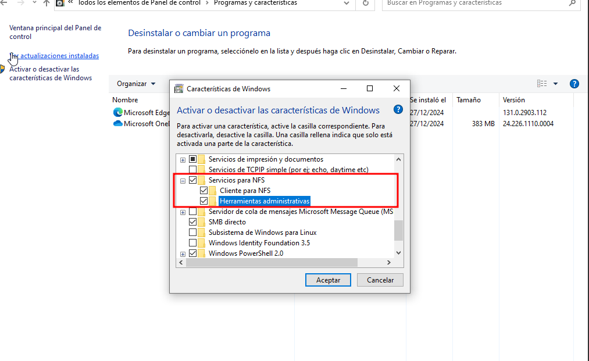
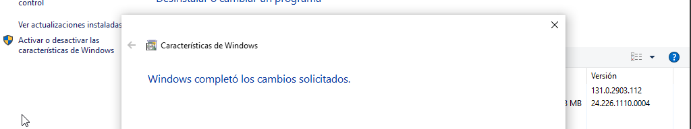

---

### 4. Ús del Servidor NFS i Compartició de Fitxers

#### A. Configuració al Servidor

En primer lloc, creem la carpeta que volem compartir (per exemple, `/compartida`), li assignem propietari i grup com a `nobody` i `nogroup` per a l'accés genèric, i li configurem els permisos adequats perquè tothom pugui llegir i escriure:

```bash
sudo mkdir /compartida
sudo chown nobody:nogroup /compartida
sudo chmod 777 /compartida
ls -ld /compartida
```

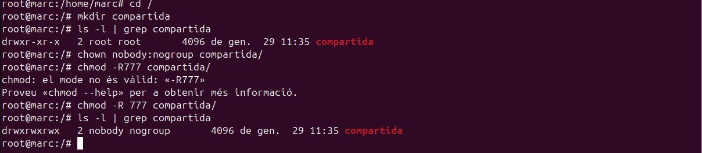

Per exportar aquesta carpeta a la xarxa, editem el fitxer de configuració de comparticions de NFS `/etc/exports`:

```bash
sudo nano /etc/exports
```

Dins d'aquest fitxer, afegim la línia per compartir `/compartida` amb tots els clients (`*`) amb permisos de lectura i escriptura (`rw`), sincronització immediata (`sync`) i desactivant la comprovació de subarbres per millorar el rendiment (`no_subtree_check`):

```text
/compartida *(rw,sync,no_subtree_check)
```

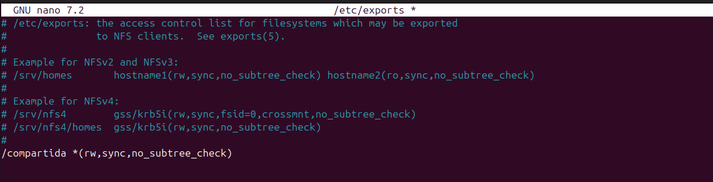

Després de modificar `/etc/exports`, reiniciem el servei NFS per aplicar els canvis. També podem crear un fitxer de prova buit dins del directori compartit per comprovar posteriorment la lectura des dels clients:

```bash
sudo systemctl restart nfs-kernel-server
sudo touch /compartida/hola
```

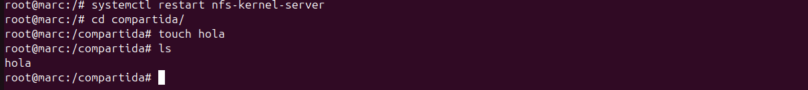

#### B. Proves de connexió des de Windows

Ara passem al client Windows per connectar-nos al recurs. Obrim l'explorador de fitxers i ens dirigim a la IP del servidor (per exemple, `\\10.0.2.16`) per veure els recursos disponibles:

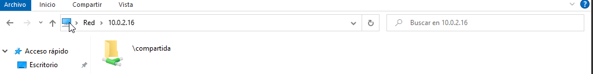

Podrem observar que apareix la carpeta `compartida`. Si hi entrem, veurem el fitxer `hola` que hem creat des del servidor:

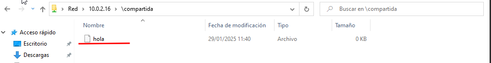

Per provar els permisos d'escriptura des de Windows, creem un nou arxiu de text anomenat `mrworldwide.txt` a dins:

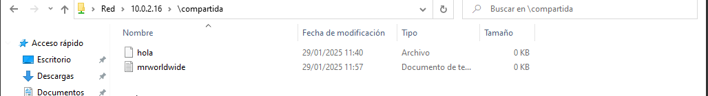

Si tornem al servidor i llistem els detalls de la carpeta, veurem que el nou arxiu té uns ID de propietari i grup específics associats a l'usuari anònim de Windows:

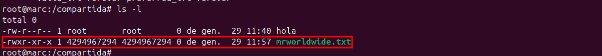

#### C. Proves de connexió des del Client Ubuntu

Ara farem la mateixa prova en el nostre client Ubuntu. Creem un directori local per al punt de muntatge (per exemple, `/mnt/nfs`), li donem permisos totals i procedim a muntar el recurs compartit indicant la IP del servidor:

```bash
sudo mkdir -p /mnt/nfs
sudo chmod 777 /mnt/nfs
sudo mount 10.0.2.16:/compartida /mnt/nfs/
df -h
```

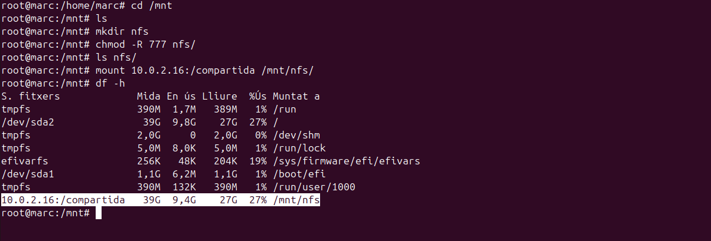

Si llistem el contingut del punt de muntatge local, veurem tant el fitxer `hola` original com l'arxiu creat per Windows:

```bash
ls -l /mnt/nfs
```

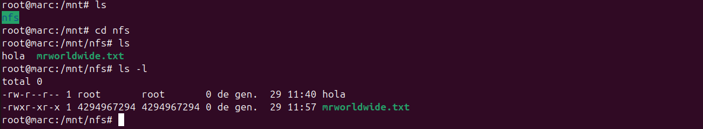

Finalment, creem un arxiu des del client Ubuntu per assegurar-nos que tenim drets d'escriptura. En llistar-lo, observem que el propietari es maps automàticament a `nobody:nogroup`:

```bash
touch /mnt/nfs/asdf
ls -l /mnt/nfs
```

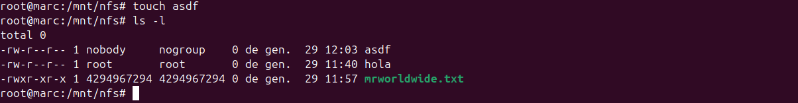

---

### 5. Integració de NFS amb usuaris LDAP

Una de les utilitats principals d'integrar NFS amb LDAP es permetre que els directoris personals (`/home/nom_usuari`) estiguin centralitzats al servidor i es muntin dinàmicament a la màquina client quan l'usuari inicia la sessió.

#### A. Configuració al Servidor NFS

Primer, preparem un nou directori al servidor NFS destinat a allotjar els perfils dels usuaris (per exemple, `/perfils`). Editem de nou el fitxer `/etc/exports`:

```text
/perfils *(rw,sync,no_subtree_check)
```

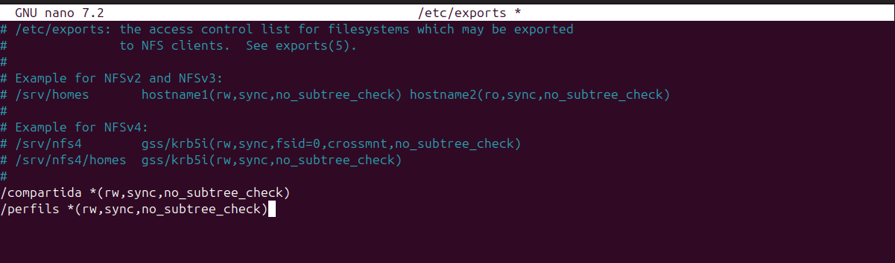

Creem la carpeta al disc del servidor, li assignem com a propietari `nobody:nogroup` i donem permisos totals de lectura/escriptura, reiniciant el servidor NFS a continuació:

```bash
sudo mkdir /perfils
sudo chown nobody:nogroup /perfils
sudo chmod 777 /perfils
sudo systemctl restart nfs-kernel-server
```

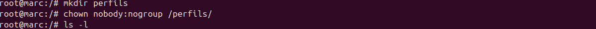

#### B. Modificació del Servidor LDAP per a l'usuari

Perquè el client sàpiga que el directori de l'usuari està localitzat a `/perfils/alu4`, hem de crear o modificar l'usuari en el directori LDAP. Creem un fitxer LDIF (per exemple, `usu.ldif`) definint el nou usuari `alu4` i assignant-li la propietat `homeDirectory` apuntant a la ruta centralitzada:

```text
dn: uid=alu4,ou=users,dc=sabate,dc=cat
objectClass: inetOrgPerson
objectClass: posixAccount
objectClass: shadowAccount
cn: alu4
sn: alu4
uid: alu4
uidNumber: 2004
gidNumber: 2001
homeDirectory: /perfils/alu4
loginShell: /bin/bash
```

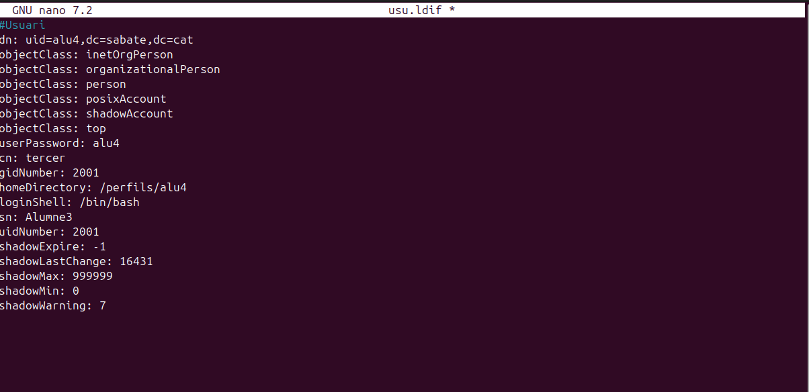

Afegim aquest usuari a la base de dades del servidor LDAP:

```bash
ldapadd -x -D "cn=admin,dc=sabate,dc=cat" -w marc -f usu.ldif
```

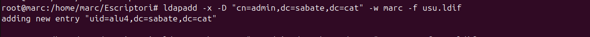

#### C. Configuració del Client per al muntatge automàtic

Al client Ubuntu, per tal que en arrencar el sistema es munti el directori centralitzat `/perfils`, primer creem la carpeta corresponent i li assignem permisos amplis:

```bash
sudo mkdir /perfils
sudo chmod 777 /perfils
```

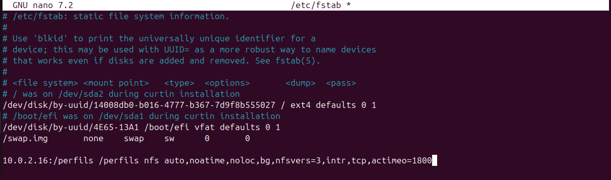

A continuació, editem el fitxer de configuració de muntatges estàtics `/etc/fstab` perquè munti automàticament la carpeta `/perfils` en iniciar-se el client:

```text
10.0.2.16:/perfils /perfils nfs auto,noatime,nolock,bg,nfsvers=3,intr,tcp,actimeo=1800 0 0
```

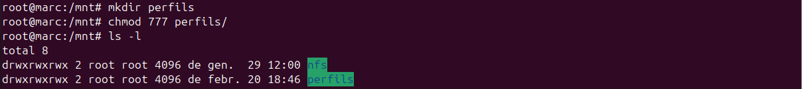

#### D. Inici de sessió de l'usuari LDAP al Client

Finalment, reiniciem el client. A la pantalla de login escollim l'opció per introduir l'usuari manualment i iniciem la sessió amb les credencials de l'usuari `alu4`. El sistema reconeixerà l'usuari a través de LDAP, muntarà el seu directori d'usuari a través de NFS a `/perfils/alu4` i el crearà automàticament.

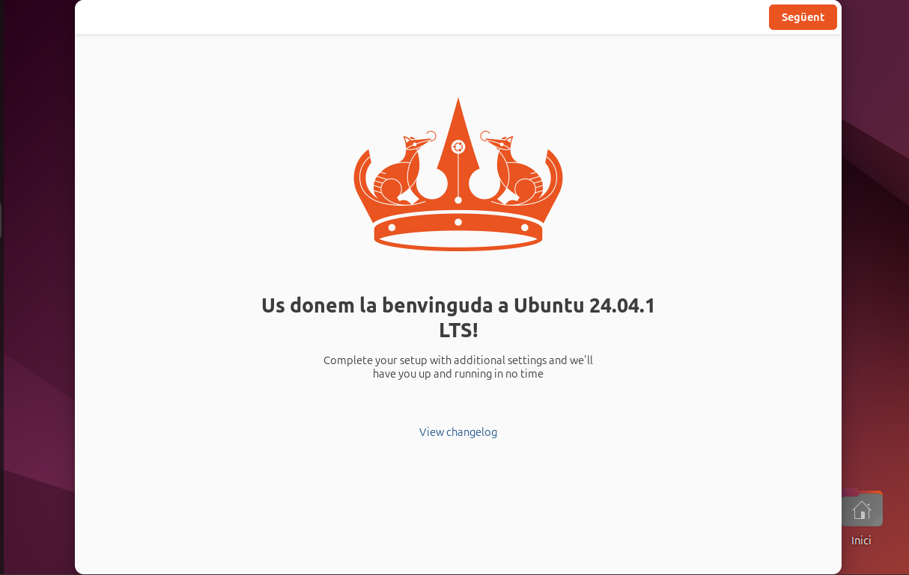

Si obrim un terminal dins d'aquesta sessió, comprovem amb `whoami` que hem entrat com a `alu4`, i el sistema ens situarà automàticament a la seva home centralitzada:

```bash
whoami
pwd
```

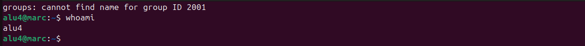

## SAMBA

Per començar amb la configuració de Samba, instal·lo el paquet necessari al servidor.

```markdown
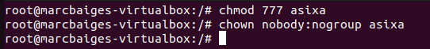

Aquí es pot veure el procés d'instal·lació del paquet samba al servidor.
```
Un cop instal·lat, comprovo l'estat del servei per assegurar-me que s'està executant correctament.

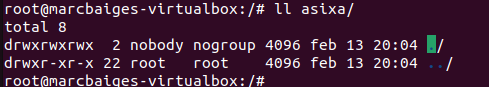

A continuació, creo la carpeta que vull compartir i li assigno els permisos necessaris perquè els usuaris hi puguin accedir.

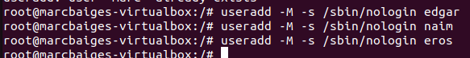
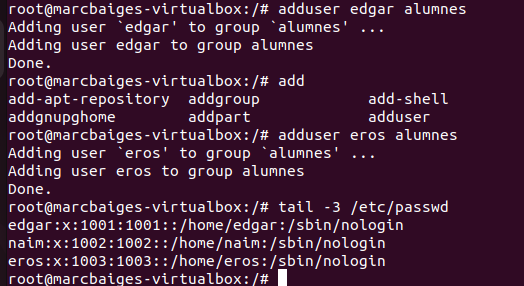

Ara edito el fitxer de configuració principal de Samba `/etc/samba/smb.conf`.

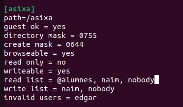

Dins del fitxer, defineixo el recurs compartit amb la seva ruta i els permisos de lectura/escriptura.

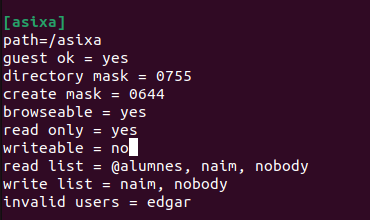

Utilitzo la comanda `testparm` per verificar que no hi hagi errors de sintaxi en la configuració.

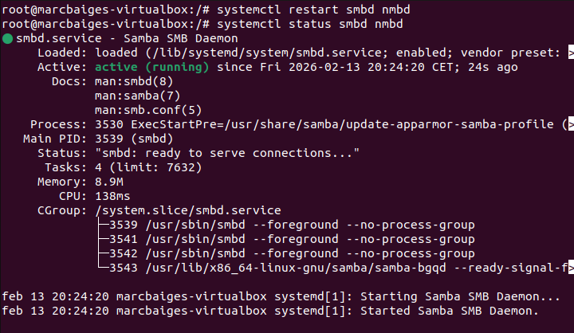

Reinicio els serveis de Samba per aplicar els canvis realitzats.

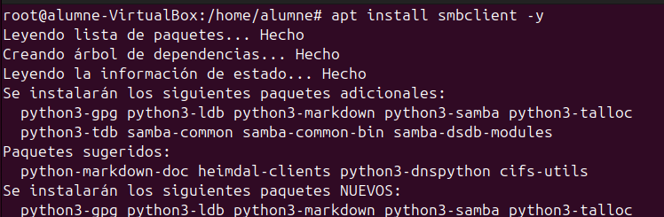

Creo un usuari al sistema que serà el que utilitzarem per connectar-nos des del client.

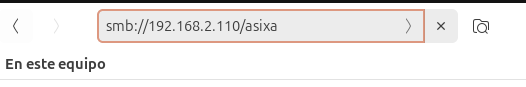

I li assigno una contrasenya específica per al servei Samba mitjançant `smbpasswd`.

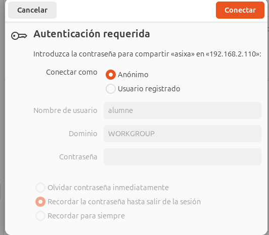

Configuro el tallafocs (ufw) per permetre el trànsit de dades de Samba.

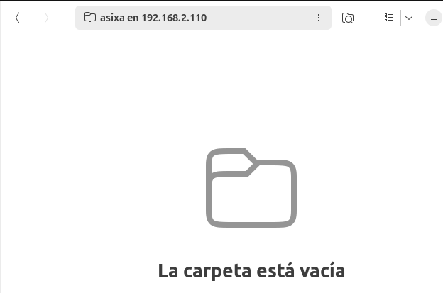

Des del client, comprovo primer la connectivitat amb el servidor.

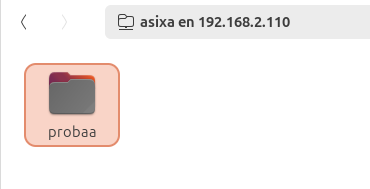

Instal·lo el paquet `cifs-utils` al client per poder muntar unitats de xarxa.

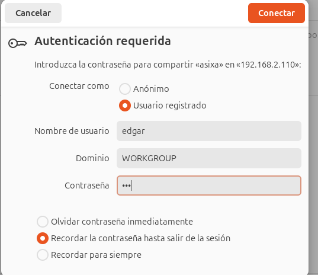

Intento accedir al recurs compartit mitjançant l'explorador de fitxers utilitzant la IP del servidor.

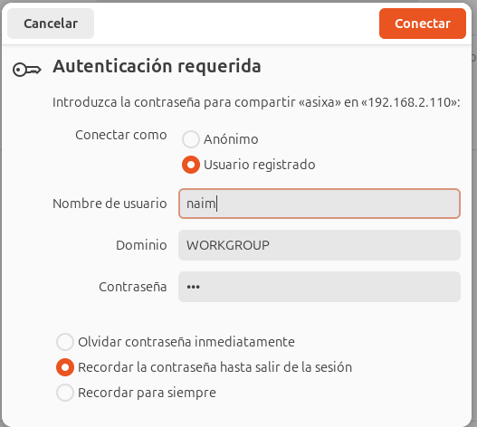

El sistema ens demanarà les credencials de l'usuari que hem creat prèviament.

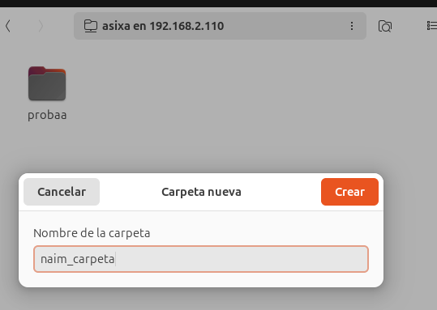

Un cop autenticats, ja podem veure el contingut de la carpeta compartida.

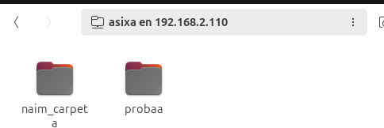

Faig una prova creant un fitxer des del client per comprovar que tenim permisos d'escriptura.

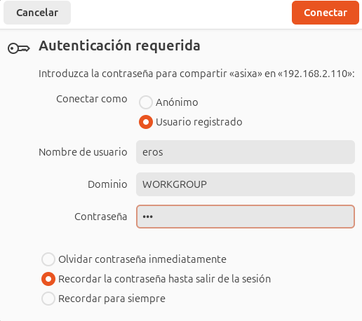

Comprovo al servidor que el fitxer s'ha creat correctament.

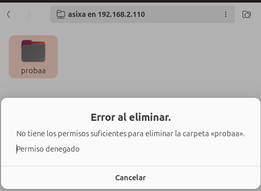

Per automatitzar el procés, configuro el fitxer `/etc/fstab` al client per muntar la carpeta en iniciar el sistema.

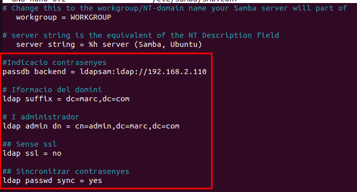

Executo el muntatge manualment per verificar que la línia del fstab és correcta.

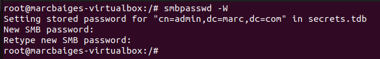

Finalment, verifico que el punt de muntatge està actiu i accessible.

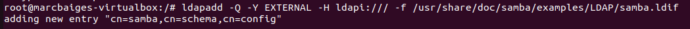
