# Documentació RAID

## Introducció als RAID
Els RAID (Redundant Array of Independent Disks) són tècniques que combinen diversos discs físics per crear un sistema d'emmagatzematge unificat, millorant el rendiment i/o la seguretat de l'emmagatzematge segons el nivell utilitzat.

Avui en dia també existeixen solucions que, tot i no ser RAID en el sentit tradicional, ofereixen funcions similars de redundància i tolerància a fallades. Un exemple d'això és **CEPH**, un sistema d'emmagatzematge distribuït que proporciona redundància avançada, auto balanceig i alta escalabilitat.

## Nivells RAID més comuns

| Nivell RAID | Descripció | Avantatges | Desavantatges |
| :--- | :--- | :--- | :--- |
| RAID 0 | Distribueix les dades sense redundància | Alt rendiment | Cap tolerància a fallades |
| RAID 1 | Duplica les dades en dos discs (mirall) | Protecció de dades | Capacitat efectiva reduïda (50% utilitzable) |
| RAID 5 | Distribueix dades amb informació de paritat | Bon equilibri entre rendiment i seguretat | Mínim 3 discs; rendiment d'escriptura inferior |
| RAID 6 | Igual que RAID 5, però amb doble paritat | Pot tolerar la fallada de fins a 2 discs | Rendiment d'escriptura més baix; necessita més discs |
| RAID 10 | Combina duplicació (RAID 1) i distribució (RAID 0) | Molt alt rendiment i seguretat | Cost elevat per la necessitat de més discs |

## ZFS: Sistema d'arxius amb funcions RAID
**ZFS** és un sistema d'arxius combinat amb gestor de volums desenvolupat per Sun Microsystems (ara Oracle). Entre les seves característiques destaca:
* **Integritat de dades:** Utilitza sumes de verificació i té capacitat d'auto reparació.
* **Snapshots i clonació:** Permet fer còpies de seguretat i recuperar dades fàcilment.
* **Compressió i deduplicació:** Optimitza l'ús de l'espai.
* **Pooled storage:** Facilita una gestió flexible dels discos.

ZFS integra els seus esquemes de redundància, coneguts com a **RAID-Z**, que són funcionalment equivalents als RAID tradicionals però amb millores en rendiment, fiabilitat i simplicitat de gestió.

## Solució d'emmagatzematge distribuït: CEPH
**CEPH** és un sistema d'emmagatzematge distribuït que va més enllà del concepte tradicional de RAID. Les seves principals característiques són:
* **Redundància avançada:** Utilitza replicació i erasure coding per garantir la disponibilitat de les dades.
* **Auto balanceig:** Redistribueix automàticament la càrrega entre nodes per optimitzar el rendiment.
* **Escalabilitat:** Permet ampliar la capacitat d'emmagatzematge afegint més nodes sense parades.

Tot i que CEPH opera a un nivell diferent (distribuït i basat en programari), comparteix amb els RAID l'objectiu de protegir i optimitzar l'emmagatzematge de dades.

## Aspectes clau en la configuració de RAID
* **Uniformitat dels discs i particions:** Es recomana utilitzar discs o particions de la mateixa marca i capacitat per obtenir una configuració òptima.
* **Planificació de la configuració:** Cal preparar correctament els discs, configurar el nivell RAID desitjat i, finalment, automatitzar el muntatge per facilitar l'accés a les dades.

## Taula comparativa: RAID vs CEPH vs ZFS

| Característica | RAID | CEPH | ZFS |
| :--- | :--- | :--- | :--- |
| **Tipus** | Tècnica d'agrupació de discs | Sistema d'emmagatzematge distribuït | Sistema d'arxius amb gestor de volums i redundància integrada |
| **Implementació** | Hardware o software | Basat en programari, distribuït en múltiples nodes | Integrat amb el sistema d'arxius, amb gestió flexible de volums |
| **Redundància** | Mirroring, paritat (RAID 1,5,6,10, etc.) | Replicació i erasure coding | RAID-Z (integració de paritat amb copy-on-write) |
| **Escalabilitat** | Limitada al grup fix de discs | Altament escalable afegint nodes | Escalabilitat dins del pool, encara que amb menys flexibilitat que CEPH |
| **Gestió** | Pot requerir configuració manual | Automatitza la redistribució i recuperació de dades | Simplifica la gestió amb funcions avançades (snapshots, clonació, etc.) |
| **Funcions avançades** | Centrat en redundància i rendiment | Alta disponibilitat, tolerància a fallades i gestió distribuïda | Integritat de dades, compressió, deduplicació, snapshots, etc. |

---

# Configuració Pràctica de RAID 1

Aquest document descriu el procés per configurar un RAID 1 utilitzant dos discs d'1GB. RAID 1 duplica les dades entre els discs, oferint redundància i protecció en cas de fallada d'algun d'ells.

## 1. Preparació dels Discs
Neteja dels discs: Assegureu-vos que els discs estan nets o que les dades que contenen es poden esborrar.
Creació de particions: Quan creeu les particions, recordeu d'especificar l'opció "t" per definir el tipus de partició i "fd" per indicar que és de tipus Linux RAID autodetectable.

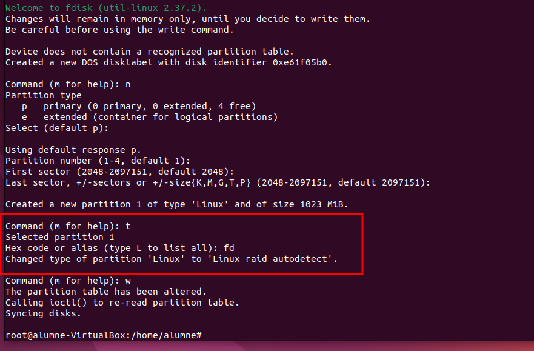

## 2. Instal·lació de l'eina de gestió (mdadm)
Instal·leu l'eina que permetrà gestionar el RAID.

```bash
sudo apt install mdadm
```

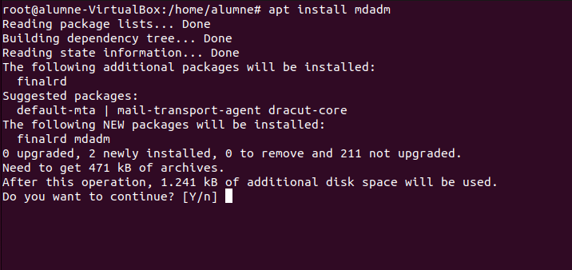

## 3. Creació del directori de muntatge
Creeu un directori on muntareu el RAID (per exemple, `/mnt/raid1`) i configureu permisos per a la prova.

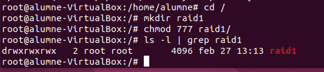

## 4. Creació del Dispositiu RAID 1
Utilitzeu `mdadm` per crear el RAID 1 amb les dues particions (p. ex. `/dev/sda1` i `/dev/sdb1`).

```bash
sudo mdadm --create /dev/md0 --level=1 --raid-devices=2 /dev/sda1 /dev/sdb1
```

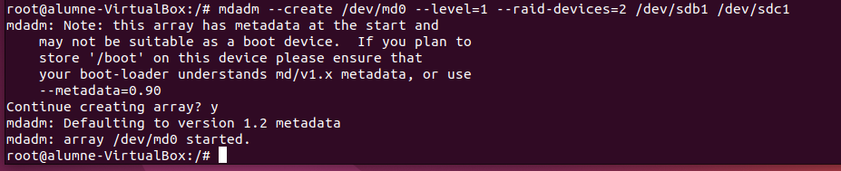

## 5. Verificació de l'estat del RAID
Podeu veure l'estat detallat del nou dispositiu.

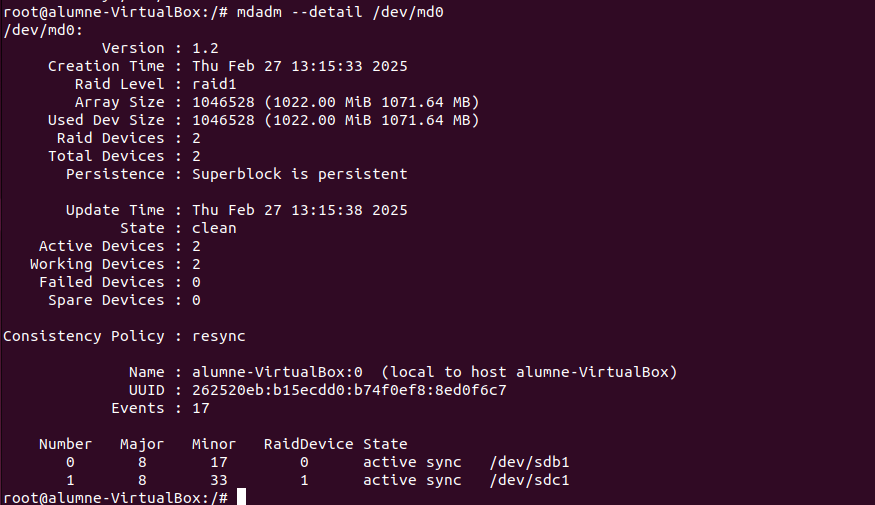

## 6. Actualització de la configuració de mdadm
Escanegeu el RAID i guardeu la configuració al fitxer corresponent per a que sigui permanent.

```bash
mdadm --detail --scan > /etc/mdadm/mdadm.conf
```

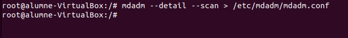

## 7. Verificació del fitxer de configuració
Comproveu que les dades s'han desat correctament al fitxer `/etc/mdadm/mdadm.conf`.

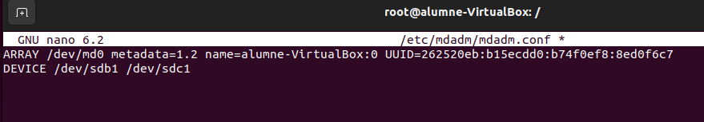

## 8. Formatació i Muntatge
Formatació del dispositiu RAID amb format `ext4`.

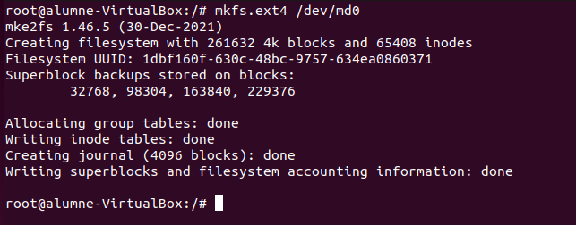

I afegiu la configuració al fitxer `/etc/fstab` per al muntatge automàtic en l'arrencada.

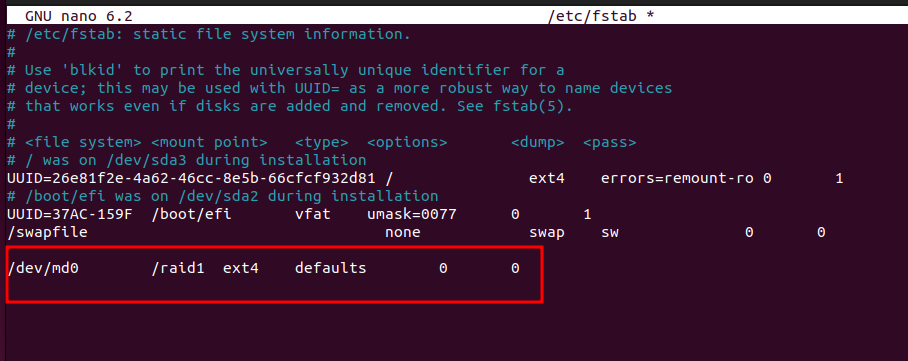

## 9. Comprovació del funcionament
Verificació de muntatge i espai:

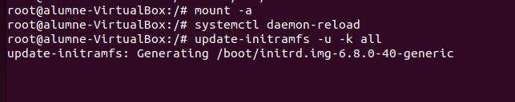

Creació d'un fitxer de prova:

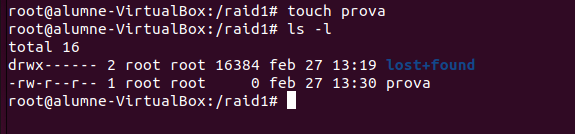

### Simulació de fallada (Fail)
Simulem la fallada d'un dels discs i comprovem que el RAID segueix funcionant.

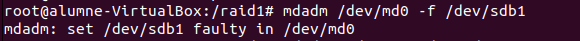
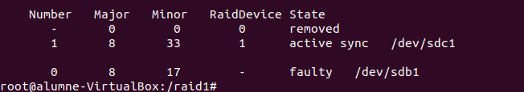
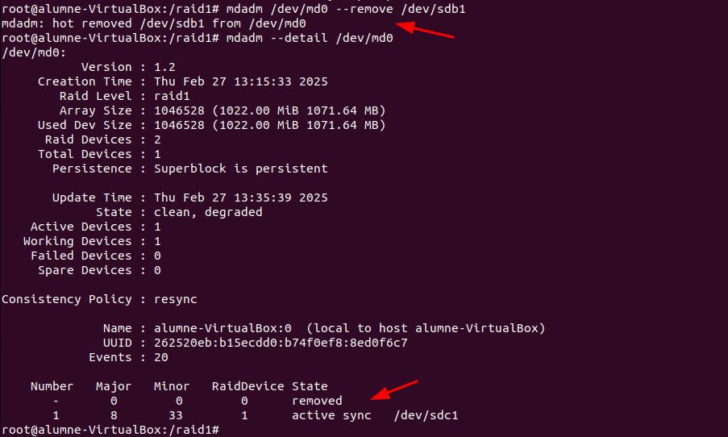

### Reconstrucció del RAID
Afegim un nou disc i veiem com el sistema comença a sincronitzar les dades automàticament.

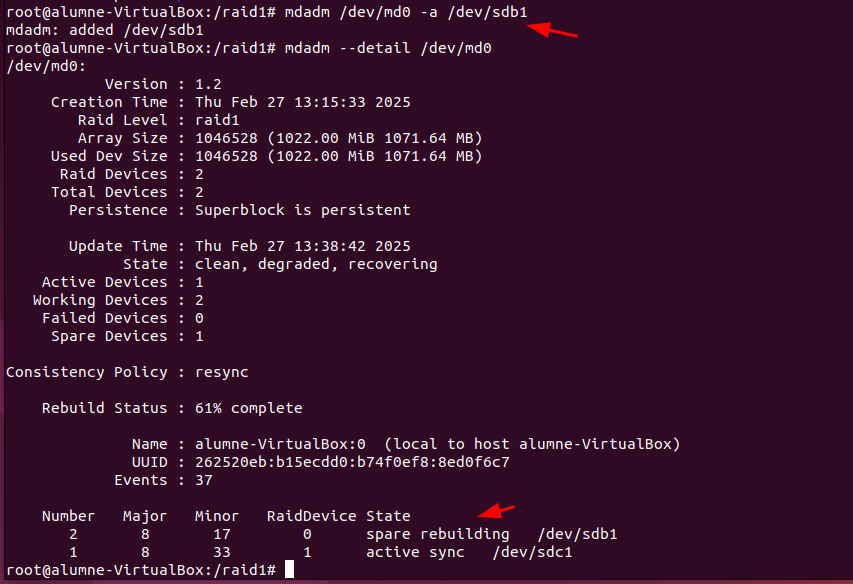
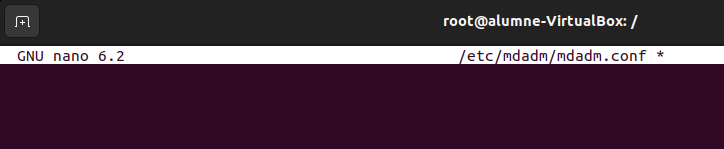

## 10. Eliminar el RAID (Opcional)
Si cal eliminar el RAID, s'han d'aturar els processos i netejar els *superblocks*.

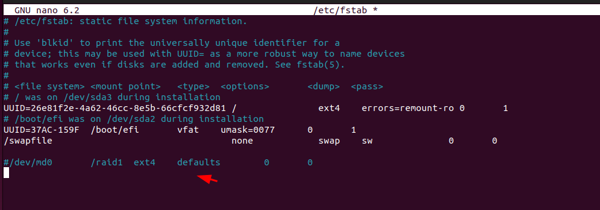

