# Partició i gestió de disc Windows

En aquest apartat veurem com afegir un disc nou en Windows.

Imagina que t'has comprat un disc, el connectes a l'ordinador i no apareix. Això és molt comú, especialment en Windows. Normalment, cal inicialitzar-lo, crear la partició i assignar-li un volum perquè es pugui utilitzar.

Afegirem el disc simulant-ho amb VirtualBox.

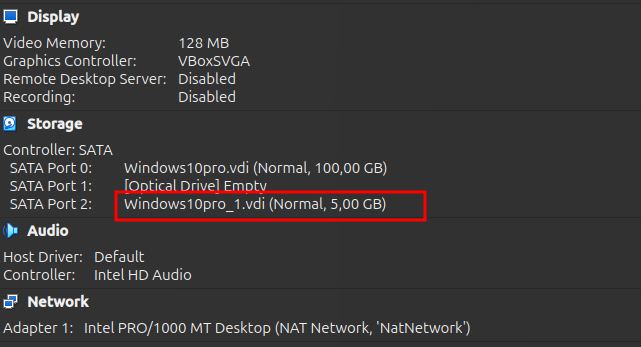

En el cercador de Windows, escriu "disc" i fes clic a l'opció **Create and format hard disk partitions**.

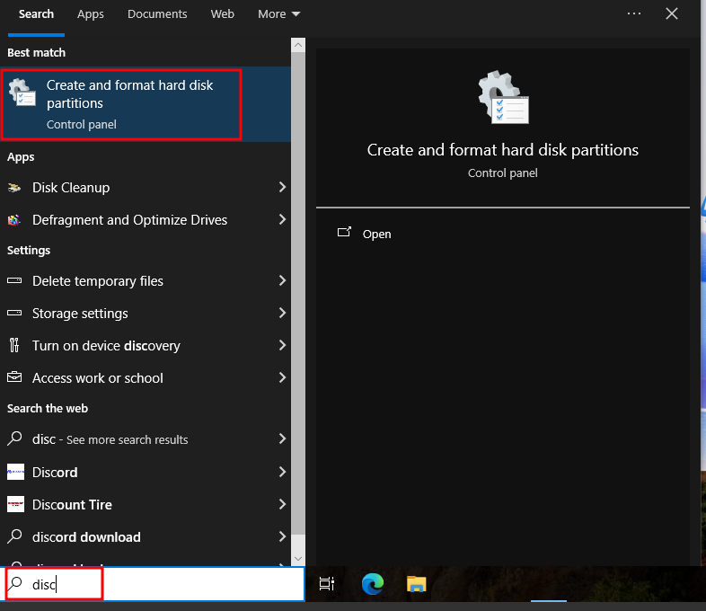

Aquí podem observar que ja ens apareix el nostre nou disc afegit.

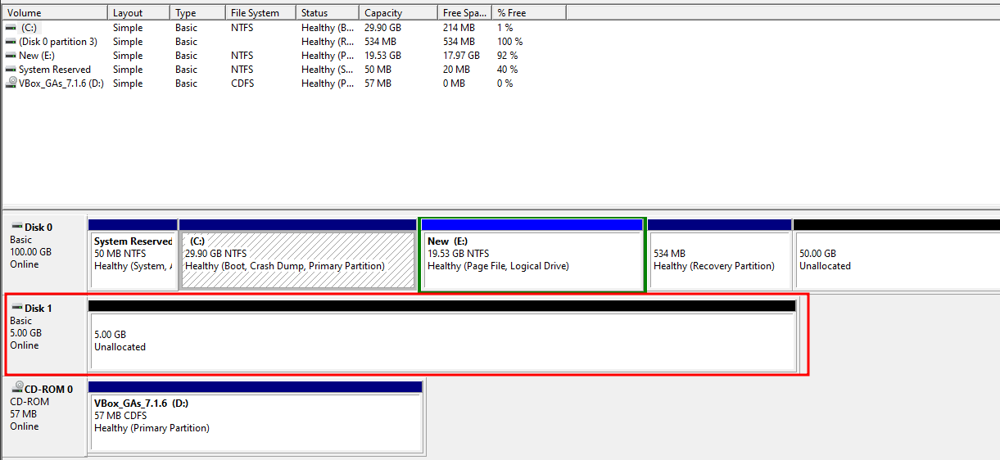

Fem clic dret sobre l’espai no assignat i després seleccionem **New Simple Volume**.

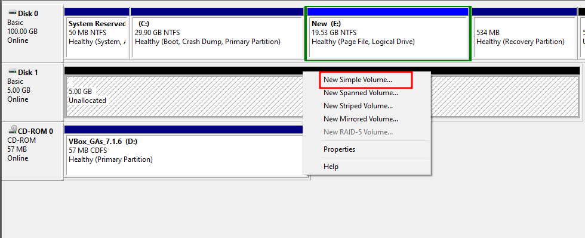

Aquesta finestra ens permet escollir la mida de la nova partició. Podem utilitzar tot l’espai disponible o només una part si volem dividir el disc en diverses particions.

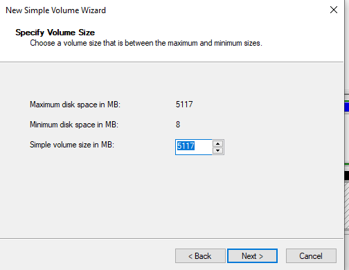

També podem assignar una lletra de unitat al disc o, si volem, muntar-lo dins d’un directori existent en un sistema de fitxers NTFS.

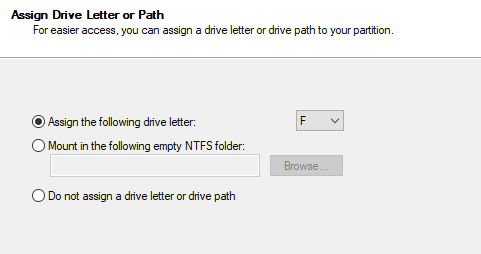

En aquest pas, seleccionem el sistema de fitxers que volem utilitzar. Per a aquesta pràctica, seleccionarem **FAT32**. També podem posar-li un nom (etiqueta de volum) i seleccionar la mida de la unitat d'assignació (allocation unit size).

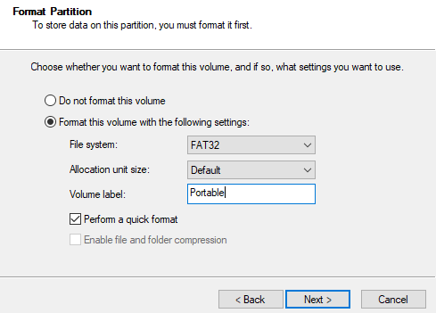

Un cop finalitzat, el disc ja estarà preparat per ser utilitzat!

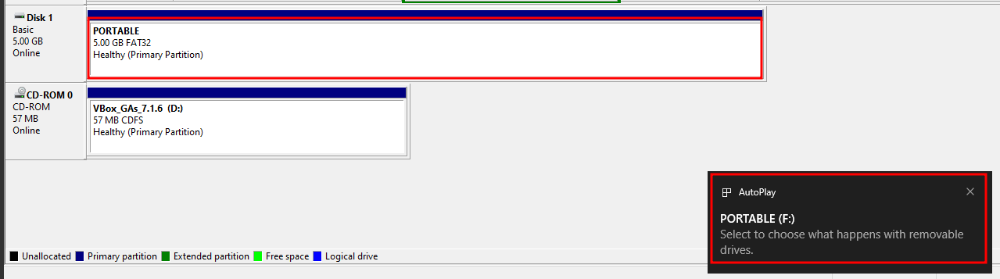

Podem també particionar el mateix disc en dos particions diferents una amb FAT32 i l'altra amb NTFS.

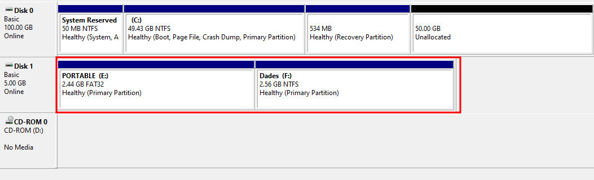

Podem comprovar la configuració del disc mitjançant la línia d’ordres amb l’eina **diskpart**. Aquesta ens permet veure quants discos hi ha, les particions de cadascun, l’estat i el sistema de fitxers utilitzat, entre altres dades útils.

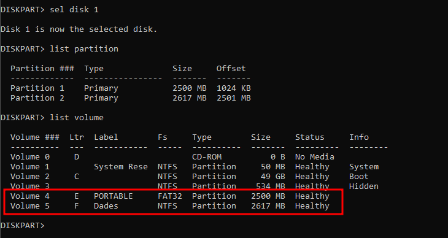

## Quotes de disc

Les quotes de disc són una funcionalitat molt útil per limitar l’espai que pot utilitzar cada usuari en un disc determinat. Això és especialment pràctic en entorns amb múltiples usuaris, com a escoles o empreses, per evitar que un usuari ompli tot l’espai disponible.

### Activar les polítiques de quotes

Primer de tot, hem d’habilitar les quotes de disc a través de les polítiques de Windows. Això es pot fer mitjançant l’Editor de polítiques locals o altres eines de configuració avançada.

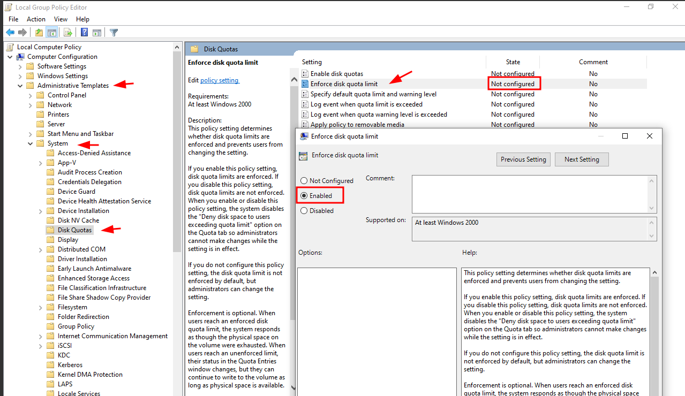

### Activar les quotes en el disc

Per assignar quotes de disc:

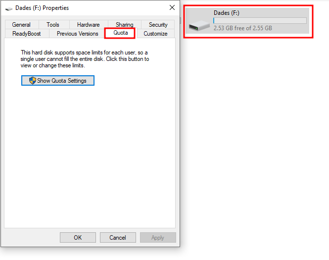

### Configurar la quota de disc

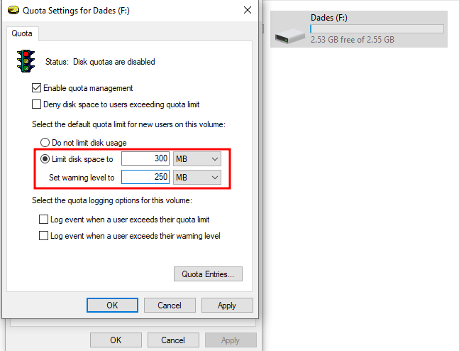

Un cop configurat, cada usuari tindrà restringit l’espai segons el límit que hagis establert.

## Usuaris

A Windows hi ha diferents formes d'afegir usuaris, però una de les més pràctiques i accessibles és mitjançant l'eina **netplwiz**. Aquesta utilitat permet gestionar comptes d'usuari locals de forma senzilla.

Comencem cercant **netplwiz** a la barra de cerca del menú Inici. Aquesta eina també es pot trobar com a "Advanced User Accounts Control Panel".

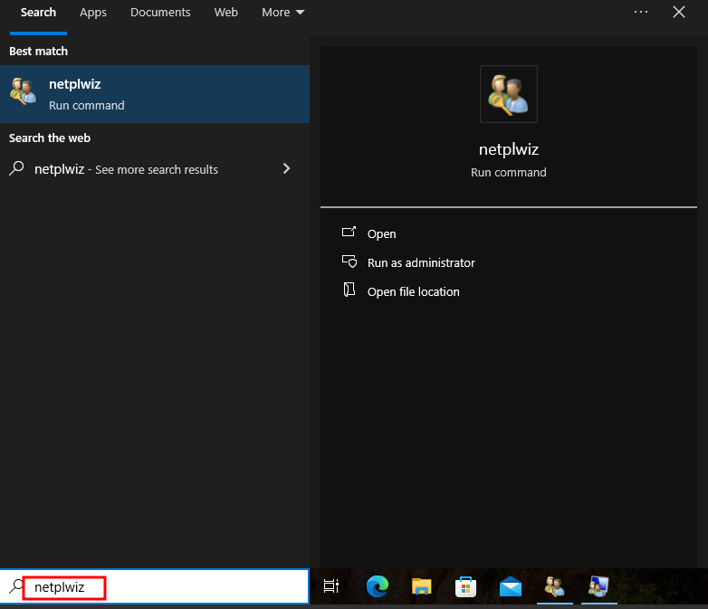

Un cop oberta la finestra, podem veure la llista d’usuaris locals. Aquí mateix es poden afegir usuaris nous mitjançant el botó **Afegeix**, però si volem un control més detallat, fem clic al botó **Advanced** per accedir a la gestió avançada.

Aquesta opció obre la consola **Local Users and Groups**, on podem veure i administrar tant usuaris com grups de forma més granular.

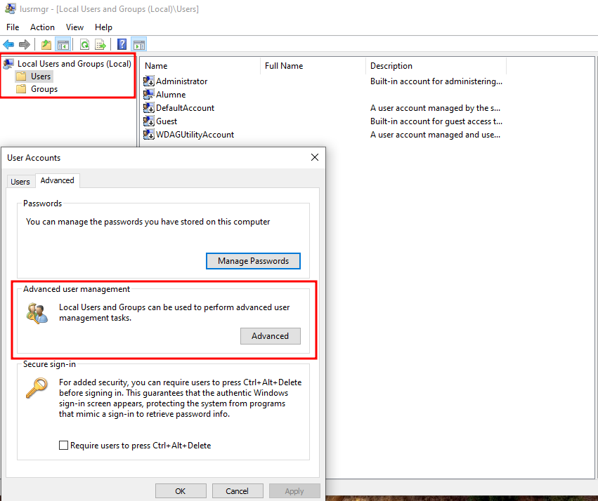

Dins la secció **Users**, si fem clic dret a l'espai buit o sobre qualezvol usuari, podem escollir **New User** per crear-ne un de nou. Aquí se'ns demana un nom d'usuari, una contrasenya (opcional), i també podem afegir una descripció i configurar opcions com obligar a canviar la contrasenya en el següent inici de sessió o impedir-ne la desactivació.

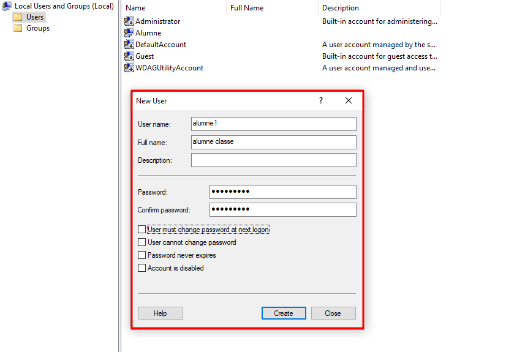

En aquest exemple, s’han creat dos usuaris de prova per fer pràctiques: per exemple, **Alumne1** i **Alumne2**.

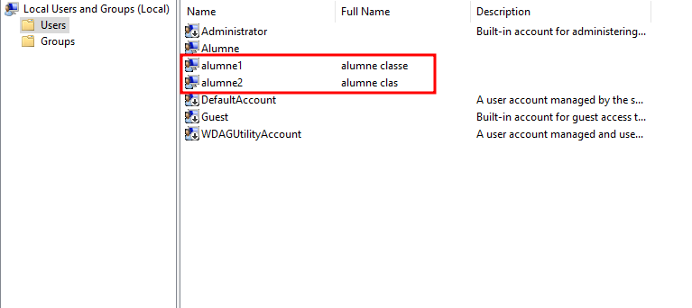

Ara podem crear un grup nou per agrupar aquests usuaris i aplicar permisos o configuracions comunes. Per fer-ho, anem a la secció **Groups**, fem clic dret i seleccionem **New Group**. Introduïm el nom del grup (per exemple, **Pràctiques**) i podem afegir-hi usuaris fent clic a **Add** i escrivint els noms dels usuaris creats anteriorment.

Això és útil per a gestionar permisos en carpetes, programes o recursos compartits de manera col·lectiva.

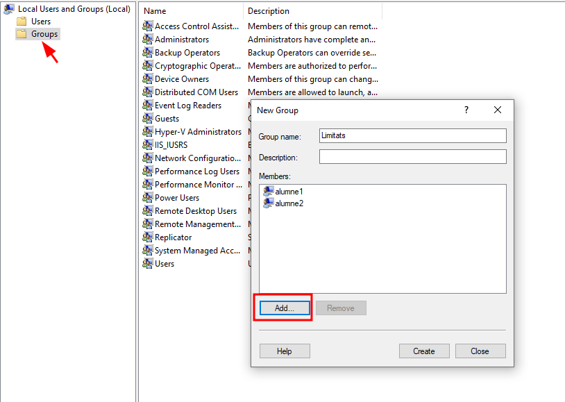

Un cop creats i afegits els usuaris al grup, podem comprovar aquesta informació fent clic dret sobre un usuari i obrint la pestanya **Member of**. Aquí veurem a quins grups pertany l’usuari, com per exemple **Users**, **Administrators**, o el grup **Limitats** que acabem de crear.

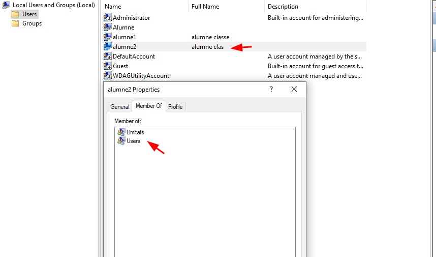

Per fer proves, podem iniciar sessió amb un dels nous usuaris, com ara **Alumne1**, i veure com es comporta el sistema segons les restriccions o permisos aplicats.

En aquest cas, hem copiat un fitxer gran i apareix un missatge de "Above limit" indicant que s’ha superat la quota de disc establerta per aquest usuari. Tot i que el sistema permet continuar, ens alerta del límit. Això es pot configurar perquè el sistema no permeti superar els 300MB, canviant la política de quotes en el sistema de fitxers NTFS.

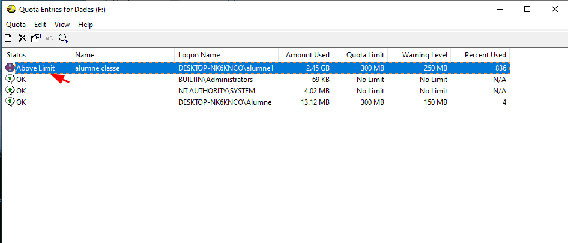

# Còpia i automatització en Windows 

## Script 
En aquest apartat parlarem de com dur a terme còpies de seguretat en Windows i automatitzar-les. 
Primer que res, afegim un nou disc a la nostra màquina virtual. 

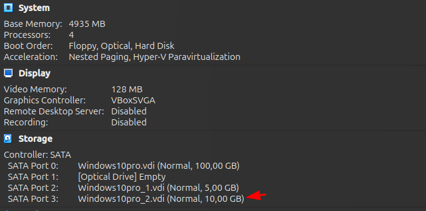

Formatem el disc amb format NTFS i creem un directori dins del volum que s'ha creat per guardar-hi les còpies de seguretat. 

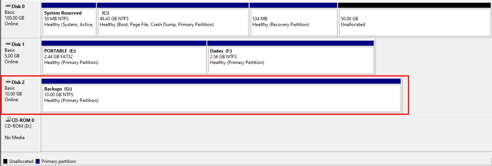

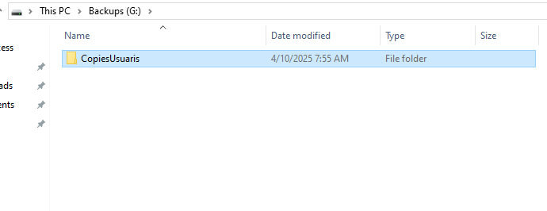

Script per copiar automàticament el perfil de l’usuari actual a G:\CopiesUsuaris\%USERNAME%: 

```
@echo off  
mkdir "G:\CopiesUsuaris\%USERNAME%"  
xcopy "C:\Users\%USERNAME%" "G:\CopiesUsuaris\%USERNAME%" /E /H /C /Y `
```
NOTA: Recorda de posar la lletra correcta del disc. En el meu cas és la G:, però en el teu pot ser una altra diferent segons com tinguis configurada la màquina. 

### Explicació breu dels paràmetres 

- /E : Copia totes les subcarpetes, fins i tot les buides 
- /H : Inclou fitxers ocults i de sistema 
- /C : Continua copiant encara que hi hagi errors 
- /Y : No demana confirmació per sobreescriure fitxers Resultat esperat: Per a l’usuari alumne1, es crea la carpeta G:\CopiesUsuaris\alumne1\ amb tot el seu perfil copiat. 

### Automatització del script 
Per automatitzar el script, cal editar les polítiques de Windows. Cerquem "gpedit" a la barra de cerca i accedim a l’editor de polítiques. 

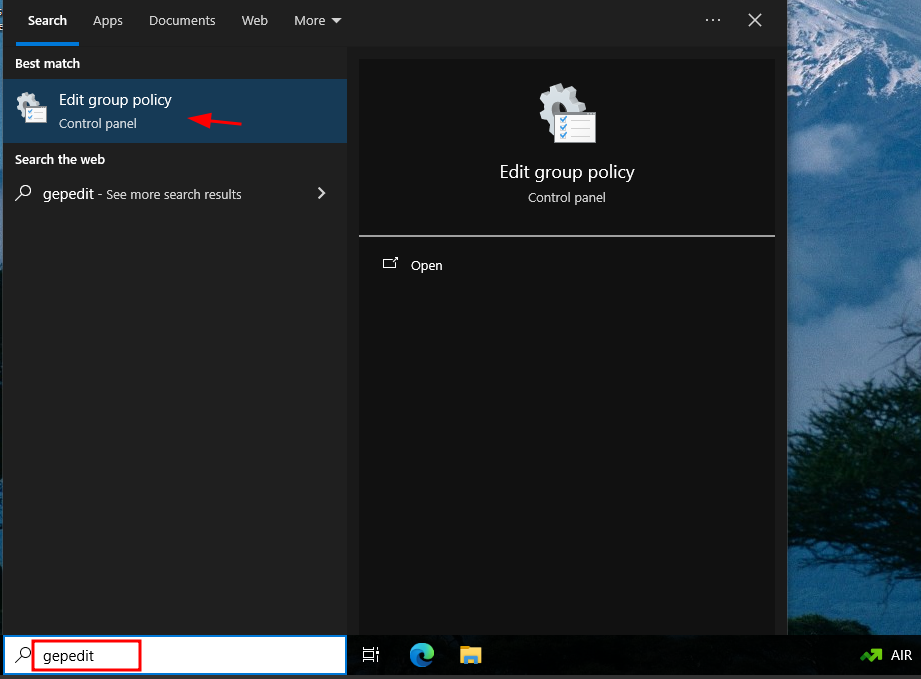

Ens dirigim a: Configuració de l'usuari → Configuració de Windows → Scripts (Inici / Tancament de sessió) → Inici de sessió 

- Fes doble clic a Inici de sessió 
- Fes clic a Afegir... 
- Clica Navega... i selecciona el fitxer `.bat `que vas crear. 
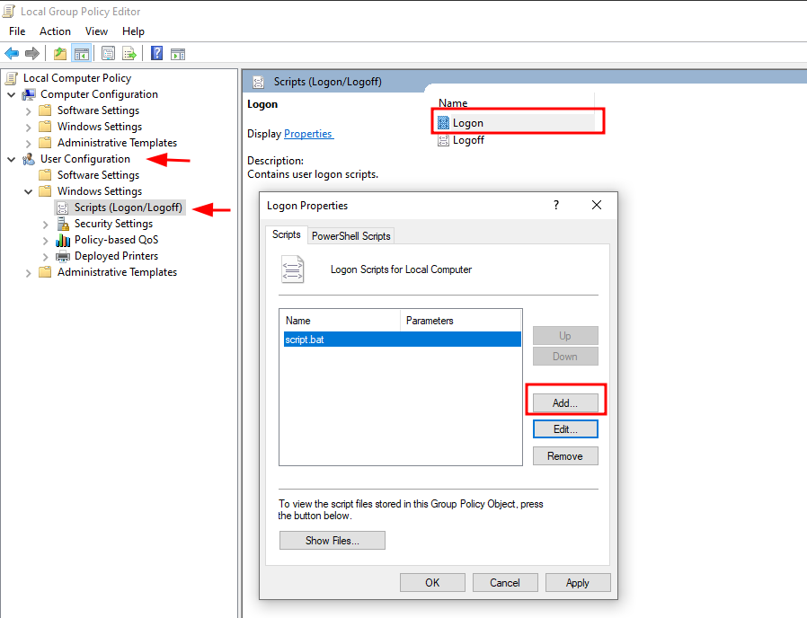

Després, pots executar: 
gpupdate /force 
Aquesta comanda s'ha d'executar a la línia d’ordres (CMD) amb permisos d’administrador. Per fer-ho: 

1. Prem `Windows + R `, escriu `cmd `i prem `Ctrl + Shift + Enter `per obrir la línia d’ordres com a administrador. 
2. Escriu la comanda i prem `Enter `. Què fa gpupdate /force? 

- `gpupdate `és una comanda que actualitza les polítiques de grup (Group Policy) que s’han aplicat al sistema o a l’usuari. 
- L’opció `/force `força la re-aplicació de totes les polítiques, tant les que han canviat com les que no. Per què és útil? 
Després de configurar un script d’inici de sessió mitjançant l’Editor de polítiques de grup (gpedit), aquestes polítiques no s’apliquen immediatament. Amb `gpupdate /force `, forcem que el sistema les apliqui de seguida, evitant haver d’esperar un reinici o una nova sessió. 
Això és molt útil per comprovar ràpidament si la configuració funciona, especialment en entorns de prova o pràctiques com aquesta. 
Quan entris amb l’usuari "alumne1", es crearà automàticament la carpeta i es farà la còpia de seguretat en segon pla. 

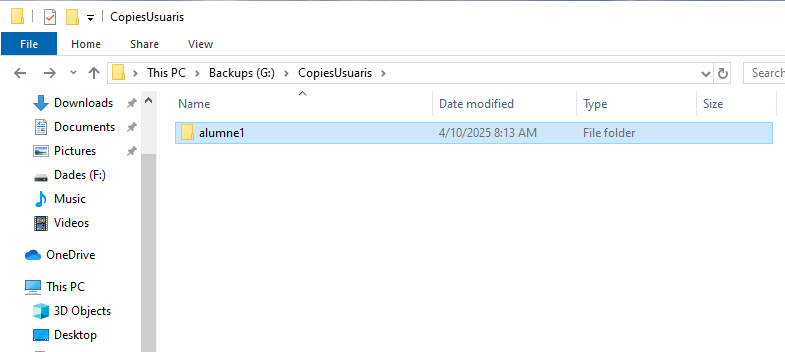

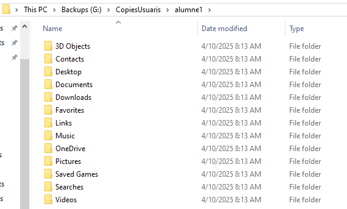


# Gestió de processos i serveis de Windows 

## Llista de processos actius 
A Windows, tots coneixem el Gestor de tasques ( Task Manager ), des d’on es poden veure els processos en execució i el consum de recursos. 
Però... sabies que també pots veure els processos des de la línia d’ordres (CMD) ? Sí, per CMD ! 
Obrim el CMD i escrivim: 
tasklist 
Això ens mostra una llista de tots els processos actius. 

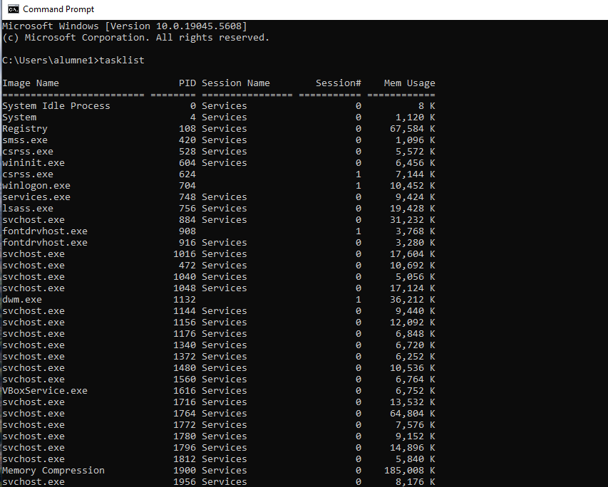

NOTA: També podem executar aquesta comanda per guardar la llista en un fitxer de text: 
tasklist > C:\Users\%USERNAME%\processos_inici.txt 
Això crea un fitxer `.txt `dins del perfil de l’usuari actual. El podem obrir per veure què s’està executant. 

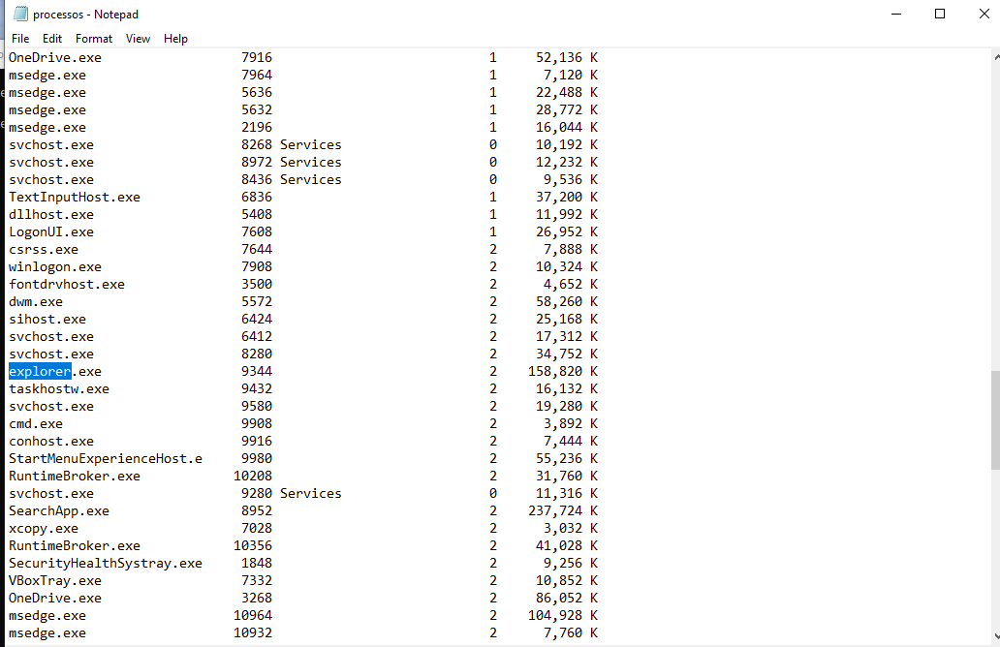

## Processos no essencials o prescindibles per a l’usuari 
Nom del procés Memòria usada Justificació per eliminar-lo OneDrive.exe 92.380 K No cal sincronització al núvol per usuaris locals en pràctiques. Estalvia recursos. msedge.exe (múltiples) ~500.000 K Consum elevat de RAM. Si no s’utilitza per treball directe, es pot tancar. PhoneExperienceHost.exe 125.964 K Connecta mòbils a Windows. Innecessari en entorns educatius o d'empresa. SearchApp.exe 221.460 K El cercador pot ocupar molta RAM. Pot desactivar-se per optimització. RuntimeBroker.exe (x4) ~120.000 K Servei vinculat a apps modernes (UWP). No és imprescindible si no s’utilitzen. StartMenuExperienceHost.exe 55.188 K Anima el menú Inici. Innecessari si es busca màxim rendiment. smartscreen.exe 23.388 K Filtre SmartScreen. Pot desactivar-se si no es fan instal·lacions freqüents. SecurityHealthSystray.exe 9.480 K Mostra només la icona de seguretat. No afecta el motor de Windows Defender. 

## Eliminar processos manualment 
Dins del CMD es poden tancar processos no essencials amb la comanda `taskkill `. 

### Comandes per eliminar processos: 
taskkill /IM OneDrive.exe /F taskkill /IM msedge.exe /F taskkill /IM PhoneExperienceHost.exe /F taskkill /IM SearchApp.exe /F taskkill /IM RuntimeBroker.exe /F taskkill /IM StartMenuExperienceHost.exe /F taskkill /IM smartscreen.exe /F taskkill /IM SecurityHealthSystray.exe /F 
Nota: Alguns processos (com `msedge.exe `o `RuntimeBroker.exe `) poden tenir múltiples instàncies. Pot caldre executar la comanda diverses vegades o identificar el PID i tancar-lo específicament. 

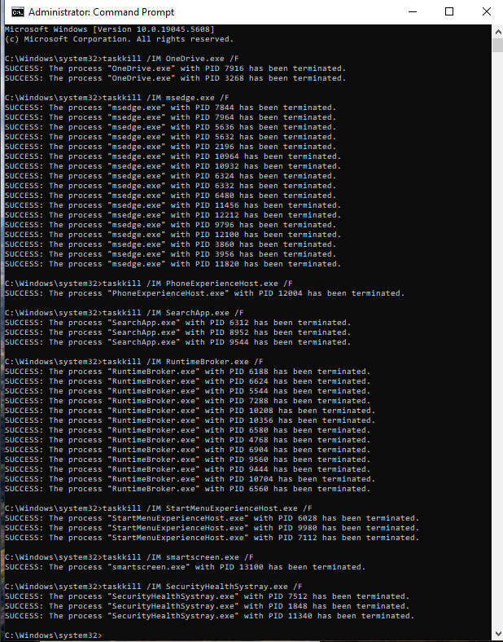

## Comprovar si han estat eliminats 
Executa de nou: 
tasklist o bé: tasklist | findstr nom_del_process 
Per exemple: 
tasklist | findstr OneDrive.exe 

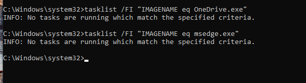

Si el procés ja no apareix , vol dir que s’ha tancat correctament. 

### Què passa si mates un procés crític com explorer.exe? 
El procés `explorer.exe `és el que gestiona l’escriptori de Windows, la barra de tasques i l’explorador d’arxius. És un procés essencial per a la interfície gràfica de l’usuari. 
Si tanquem `explorer.exe `amb la comanda: 
taskkill /IM explorer.exe /F 
Resultat immediat: 

- Desapareix l’escriptori, la barra de tasques i qualsevol finestra de l’Explorador de fitxers. 
- Sembla que el sistema “ha penjat”, però realment tot segueix funcionant en segon pla. 
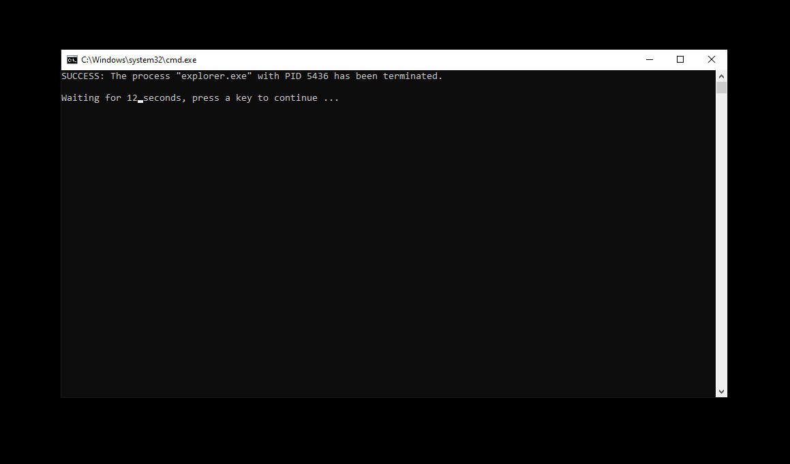

Recuperació (prova controlada): 
Pots obrir el Gestor de tasques ( `Ctrl + Shift + Esc `) > Fitxer > Executa una nova tasca > escriu `explorer.exe `i fes clic a D'acord . 
Això reiniciarà el procés i recuperaràs la interfície gràfica sense necessitat de reiniciar l’ordinador. 

### Millora del rendiment de màquines amb pocs recursos 
La gestió de processos pot suposar una millora significativa del rendiment en equips amb pocs recursos (per exemple, màquines virtuals amb poca RAM o CPU limitada). 
Beneficis concrets: 

- Redueix l'ús de memòria RAM , tancant processos en segon pla innecessaris. 
- Millora la resposta del sistema eliminant càrregues innecessàries al processador. 
- Evita bloquejos o alentiments causats per serveis que no s'utilitzen (com OneDrive, serveis mòbils, animacions visuals, etc.). 
- Permet optimitzar equips de pràctiques, tallers o laboratoris, on el rendiment és més important que la funcionalitat visual . Aquesta tècnica és especialment recomanada per entorns educatius o empresarials on es reutilitzen equips antics o virtualitzats amb recursos limitats. 

## Automatització per a eliminar els processos 
Per fer aquesta tasca de manera automàtica, podem crear un script `.bat `que s’executi cada cop que iniciem la sessió de Windows. 
Aquest script s’encarregarà d’aturar automàticament els processos que considerem no essencials o innecessaris . Ja sabem com configurar scripts d’inici de sessió mitjançant les polítiques de grup (gpedit), com hem vist anteriorment. 
A continuació, es mostra un exemple senzill d’script: 

```
@echo off  
taskkill /IM OneDrive.exe /F  
taskkill /IM msedge.exe /F  
taskkill /IM PhoneExperienceHost.exe /F  
taskkill /IM SearchApp.exe /F  
taskkill /IM RuntimeBroker.exe /F  
taskkill /IM StartMenuExperienceHost.exe /F  
taskkill /IM smartscreen.exe /F  
taskkill /IM SecurityHealthSystray.exe /F `
```
Pots afegir o eliminar processos del script segons les teves necessitats. Tingues en compte que eliminar processos essencials pot provocar inestabilitat. 
Com aplicar aquest script a l'inici de sessió 

1. Desa l’script amb extensió `.bat `(per exemple: `neteja_processos.bat `). 
2. Obre l’eina gpedit.msc ( `Editor de polítiques de grup local `). 
3. Ves a: Configuració de l'usuari → Configuració de Windows → Scripts (Inici de sessió) 
4. Fes doble clic a Inici de sessió i després a Afegir... 
5. Navega fins al `.bat `que has creat i selecciona’l. 
6. Aplica els canvis i tanca. 
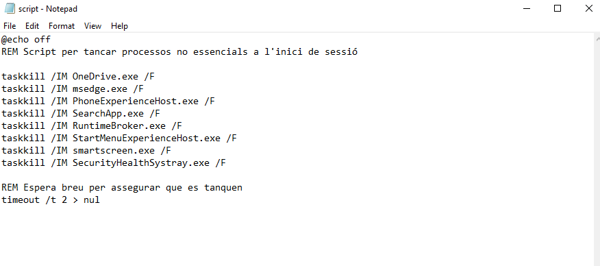

Des del pròxim inici de sessió, l’script s’executarà automàticament i tancarà els processos especificats , millorant així el rendiment i reduint l’ús de memòria. 
Al iniciar sessió amb l’usuari `alumne1 `, podem comprovar que ja no hi ha processos com OneDrive.exe en execució, ja que l’script els ha eliminat correctament durant l’inici de sessió. 

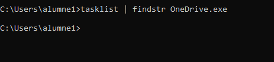

NOTA: És possible que l’script no s’executi correctament si alguns dels processos necessiten permisos d’administrador per ser aturats. 

### Solucions si l’script no funciona com esperat: 
Executar l’script amb privilegis elevats (PowerShell) 
Una solució és fer servir PowerShell per obrir el `.bat `amb permisos elevats. Aquí tens un exemple de com fer-ho dins d’un script `.ps1 `: 

```
Start-Process "C:\ruta\al\teu_script.bat" -Verb RunAs `
```
Aquest mètode obre el `.bat `com a administrador, però pot demanar confirmació d’UAC si està activat. 
Utilitzar el Task Scheduler per executar el script com a administrador 
Una alternativa més senzilla i estable és crear una tasca programada que executi l’script amb permisos elevats: 

1. Obre Task Scheduler ( `Planificador de tasques `). 
2. Crea una nova tasca ( Create Task... ). 
3. A la pestanya General , activa l’opció "Run with highest privileges" . 
4. A la pestanya Triggers , afegeix un nou trigger que s’executi "At log on" . 
5. A la pestanya Actions , selecciona Start a program i indica la ruta del `.bat `. 
6. Desa la tasca. Aquesta opció assegura que l’script sempre s’executi amb permisos suficients , sense necessitat d’intervenció de l’usuari. 


# Gestió de permisos (ACLs) en Windows 

## Què són les ACLs i com funcionen a Windows 
A Windows, cada fitxer i carpeta disposa d’una llista de control d’accés (ACL – Access Control List) . Aquesta llista determina qui pot fer què amb cada recurs del sistema de fitxers. 
Cada entrada dins d’una ACL rep el nom de ACE (Access Control Entry) i especifica: 
● Quina identitat (usuari o grup) està afectada ● Quins permisos té (lectura, escriptura, execució, control total, etc.) 
Els permisos ACL són molt més precisos que els permisos bàsics de compartició de carpetes, perquè: 
● Permeten definir permisos individuals per fitxer o carpeta ● Es poden aplicar a usuaris i grups de forma combinada ● Es poden configurar permisos avançats com ara: – Només lectura – Només esborrar – Control total excepte canviar permisos ● Els permisos poden ser heretats d’una carpeta superior o assignats manualment 
✦ Exemple típic: Una carpeta pot tenir permisos diferents per a `alumne1 `i `alumne2 `, encara que tots dos pertanyin al mateix grup. 

### Escenari pràctic: control d'accés a la carpeta Projectes 
Volem controlar l'accés a una carpeta anomenada `Projectes `, ubicada dins de la partició `Dades `. 

- El grup `Limitats `tindrà control total sobre aquesta carpeta. 
- L'usuari `alumne2 `només tindrà permisos de lectura , tot i formar part del grup. D’aquesta manera assegurem que: 

- Els membres del grup poden treballar lliurement dins la carpeta. 
- `alumne2 `només pot consultar el contingut , però no modificar ni esborrar res . 

### Configurar els permisos bàsics 
Obrim les propietats de la carpeta `D:\Projectes `i anem a la pestanya Seguretat . 

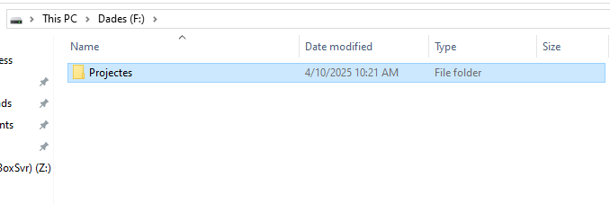

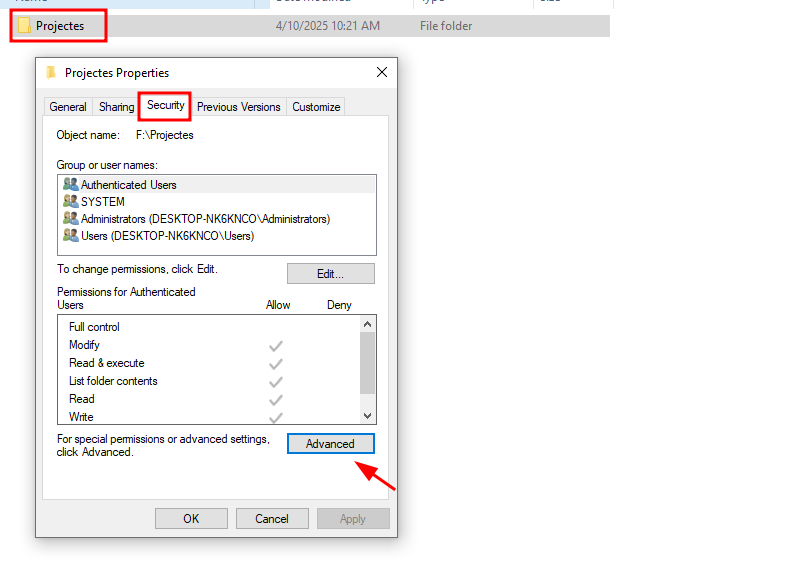

Fem clic a Avançat i desactivem la herència , conservant els permisos existents. 

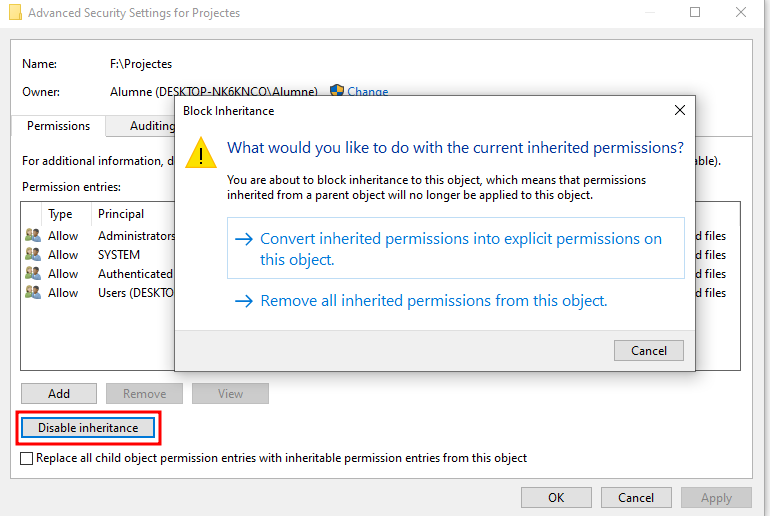

Eliminem entrades com `Users `o `Everyone `si hi apareixen. A continuació, afegim el grup `Limitats `i li assignem Control total . 

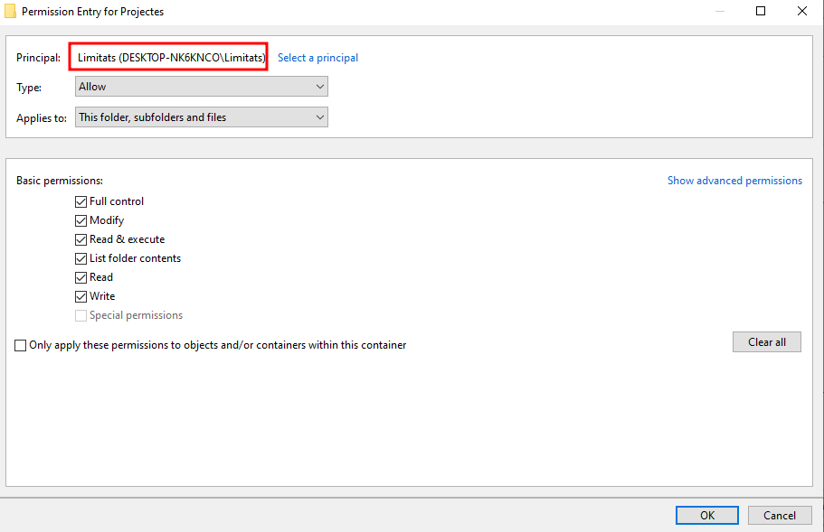

Comprovem que els permisos s’han aplicat correctament. 

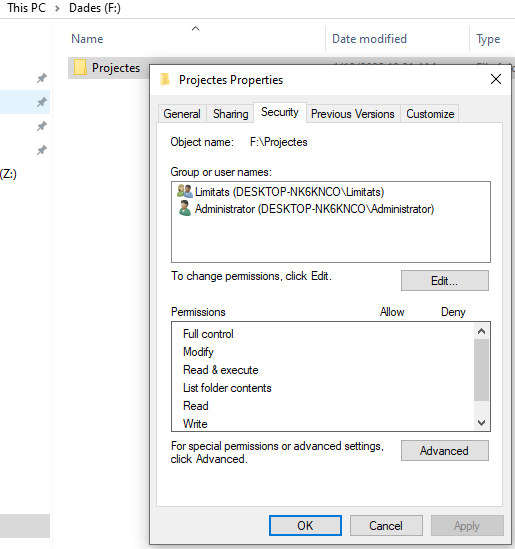

### Verificar accés amb un usuari del grup 
Iniciem sessió com `alumne1 `, que forma part del grup `Limitats `. Prova de crear una carpeta i un fitxer dins de `D:\Projectes `. 

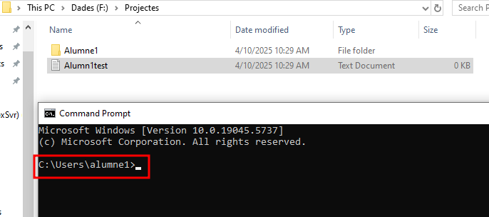

Com podem veure, `alumne1 `pot llegir, escriure, crear i esborrar contingut sense restriccions. 

### Aplicar una excepció per a `alumne2 `
Tot i formar part del grup `Limitats `, volem restringir a `alumne2 `perquè només pugui llegir . 
Iniciem sessió com a administrador i executem la comanda següent: 
icacls "D:\Projectes" /grant:r alumne2:(R) 
Aquesta comanda substitueix qualsevol permís anterior per a `alumne2 `i li assigna només lectura ( `R `). 

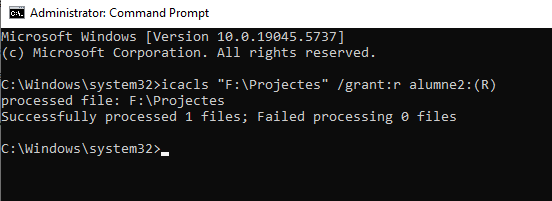

Comprovem que l’usuari apareix amb permisos específics i limitats . 

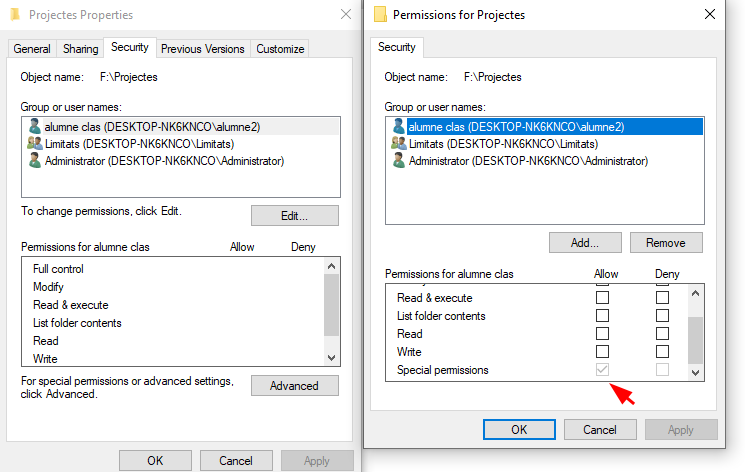

### Verificació pràctica 
Iniciem sessió com `alumne2 `i intentem crear o modificar fitxers dins de la carpeta `Projectes `. 

- Al intentar crear un directori, el sistema demana permisos d’administrador . 
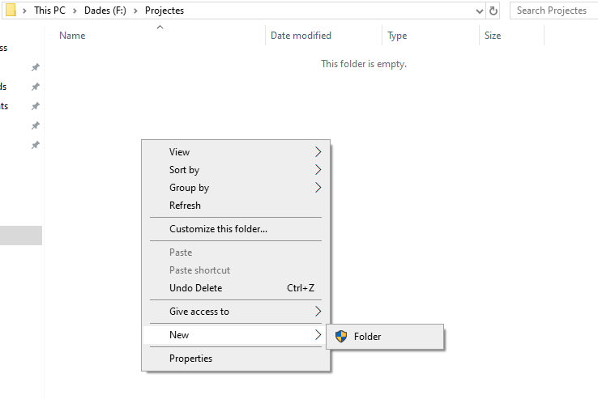

- Si intentem editar i guardar un fitxer existent, apareix un error d’accés denegat . 
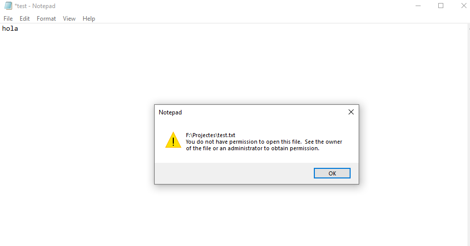

Comprovació via CMD 
Finalment, podem comprovar els permisos aplicats utilitzant la comanda `icacls `: 
icacls "D:\Projectes" 
Això mostrarà totes les entrades de permisos, incloent `alumne2 `amb lectura (R) i el grup `Limitats `amb control total. 

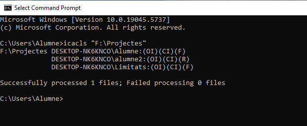

Amb aquesta configuració, aconseguim un control d’accés avançat i precís sobre els recursos del sistema, millorant tant la seguretat com l’ organització dels permisos en entorns multiusuari. 

