# Introducció a RAID en entorns Windows

Els **RAID (Redundant Array of Independent Disks)** són tècniques per combinar diversos discs físics en una unitat lògica amb l’objectiu de millorar el **rendiment**, la **capacitat** o la **tolerància a fallades**.

A Windows i Windows Server, el RAID es pot implementar de dues maneres principals:

* **RAID per programari**: a través del Gestor de discs (Disk Management) o **Storage Spaces**.
* **RAID per maquinari**: mitjançant una controladora RAID configurada des del BIOS/UEFI o eines del fabricant.

**Tipus de RAID habituals a Windows**

| Nivell RAID | Descripció | Disponibilitat a Windows | Avantatges | Inconvenients |
| --- | --- | --- | --- | --- |
| **RAID 0** | Distribució de dades entre discos (striping), sense redundància | Sí (Gestor de discs) | Alt rendiment, ús total de la capacitat | Cap tolerància a fallades |
| **RAID 1** | Mirall de dades entre dos discos | Sí (Gestor de discs) | Alta fiabilitat, fàcil de configurar | Capacitat efectiva reduïda al 50% |
| **RAID 5** | Striping amb paritat distribuïda | Només amb controladora RAID o Storage Spaces (Windows Server) | Bon equilibri entre capacitat i redundància | Mínim 3 discos; rendiment d’escriptura inferior |
| **RAID 10** | Combinació de RAID 1 i RAID 0 | Només amb controladora RAID | Molt alt rendiment i seguretat | Cost elevat, necessita mínim 4 discos |

> ⚠️ **Nota:** Windows no suporta RAID 6 per programari. Aquest nivell només està disponible mitjançant controladores RAID avançades.

**Storage Spaces (Windows 10/11 i Server)**

**Storage Spaces** és la solució moderna de RAID per programari integrada a Windows i Windows Server.

### Tipus de configuració disponibles:

* **Simple (RAID 0):** Només distribueix dades. No tolera fallades.
* **Mirall doble o triple (RAID 1/1+):** Redundància a 2 o 3 còpies.
* **Paritat:** Similar al RAID 5. Protegeix contra fallada d’1 disc (o 2 amb doble paritat en Windows Server).

### Avantatges de Storage Spaces:

* Reconfiguració en calent (hot swap).
* Alertes i supervisió des del tauler de control.
* Integració amb **ReFS** (Resilient File System) per a entorns crítics.

## Consideracions a l'hora de configurar RAID a Windows

* 🔧 **Uniformitat de discs:** És recomanable utilitzar discos de la mateixa mida, velocitat i tipus.
* 🧱 **Planificació prèvia:** El tipus de RAID escollit determinarà la redundància, rendiment i capacitat útil.
* 🔁 **Còpies de seguretat:** RAID no substitueix una política de còpies de seguretat. Cal tenir backups externs.

## Comparativa: RAID per maquinari vs RAID per programari (Windows)

| Característica | RAID per programari (Windows) | RAID per maquinari |
| --- | --- | --- |
| **Cost** | Sense cost addicional | Pot requerir controladora dedicada |
| **Rendiment** | Menor (usa recursos del sistema) | Major (gestió autònoma) |
| **Configuració** | Fàcil (interfície gràfica) | Més complexa, habitualment via BIOS |
| **Gestió de fallades** | Limitada en alguns nivells | Avançada (alertes, hot spare, etc.) |
| **Compatibilitat** | Vinculat a Windows | Pot ser multiplataforma |

---

## Recursos útils

* [Configuració de Storage Spaces a Windows (Microsoft Docs)](https://learn.microsoft.com/windows-server/storage/storage-spaces/)
* [RAID vs Storage Spaces – Comparativa tècnica (TechNet)](https://learn.microsoft.com/en-us/previous-versions/windows/it-pro/windows-server-2012-r2-and-2012/dn387076(v=ws.11))
* [ZFS a Windows (projectes alternatius)](https://openzfs.org)
# Configuració de RAID 5 a Windows (Gestió de discs)

A Windows Server, podem crear un **RAID 5 per programari** utilitzant l’eina de **Gestió de discs**. Aquest tipus de RAID ofereix **redundància mitjançant paritat**, permetent la recuperació de dades en cas de fallada d’un disc.

> ⚠️ **Important:** Aquesta funcionalitat només està disponible a **Windows Server** (no està disponible a Windows 10/11).

## Requisits previs

* Mínim **3 discos físics** no assignats (sense particions i inicialitzats).
* Els discos han d’estar convertits a **dinàmics** per poder formar un volum RAID 5.
* Opcionalment, espai reservat suficient per a dades i paritat.

---

## Passos per crear un RAID 5

**Connectar els discos**

Connecta i verifica que el sistema detecti **3 o més discos nous**. El RAID 5 requereix almenys **2 discos per a dades** i **1 disc per a la paritat**.

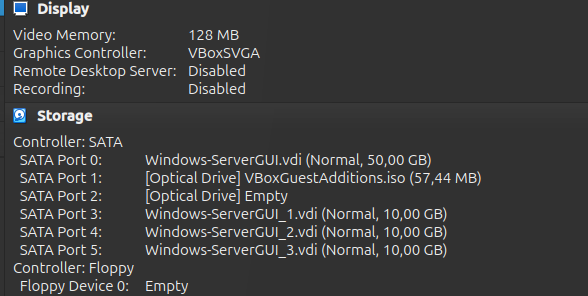

---

**Obrir la Gestió de discs**

Es pot accedir a la Gestió de discs de diverses formes:

* Fent clic dret sobre el botó de **Inici** i seleccionant **"Gestió de discs"**.
* Obrint **Executar (Win + R)** i escrivint `diskmgmt.msc`.

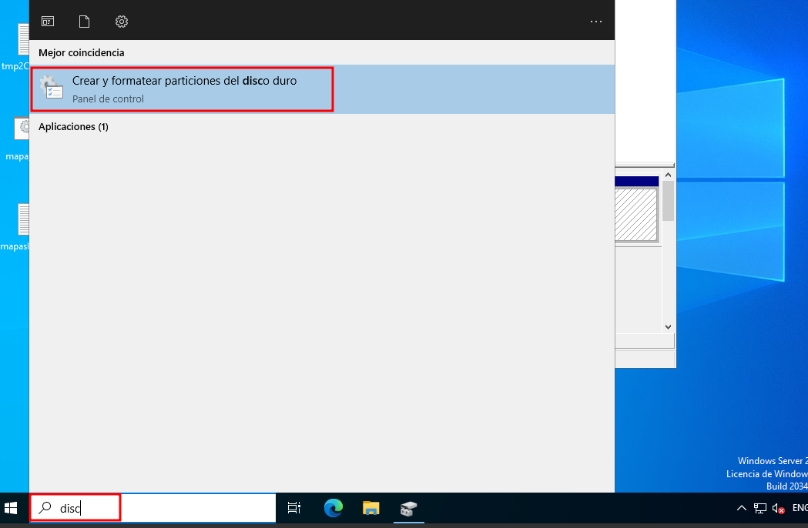

---

**Inicialitzar els discos nous**

Quan accedeixis a la Gestió de discs, el sistema detectarà els discos nous i et demanarà si vols **inicialitzar-los**. Accepta i selecciona el tipus de partició **GPT** o **MBR**, segons el cas.

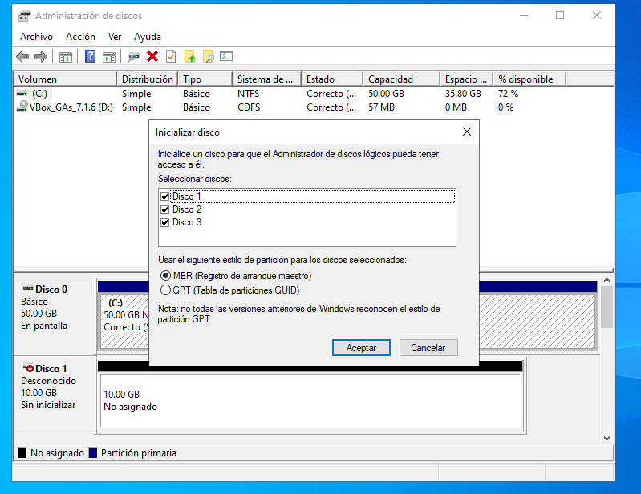

---

**Convertir a discs dinàmics**

Abans de crear el RAID, cal convertir els discos a **dinàmics**:

* Clic dret sobre cada disc nou.
* Selecciona **"Convertir a disc dinàmic"**.
* Aplica els canvis.

---

**Crear el volum RAID 5**

* Clic dret sobre un dels discos amb espai no assignat.
* Selecciona **"Nou volum RAID-5..."**.

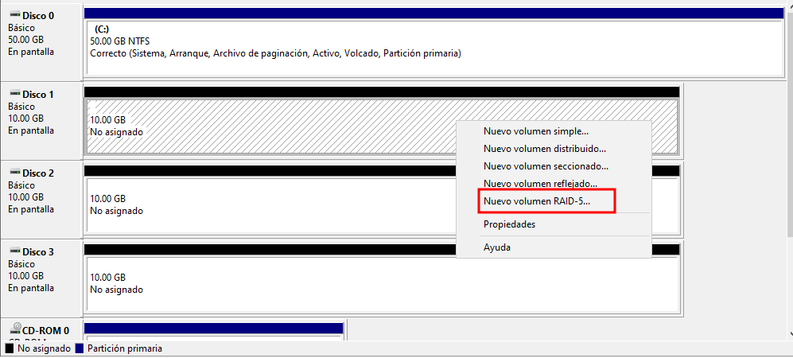

---

**Assistents i selecció de discos**

S’iniciarà l’assistent per crear el volum RAID 5.

* Fes clic a **Següent**.
* Afegeix els altres discos que formaran part del RAID 5.

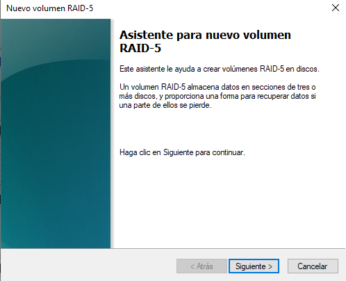

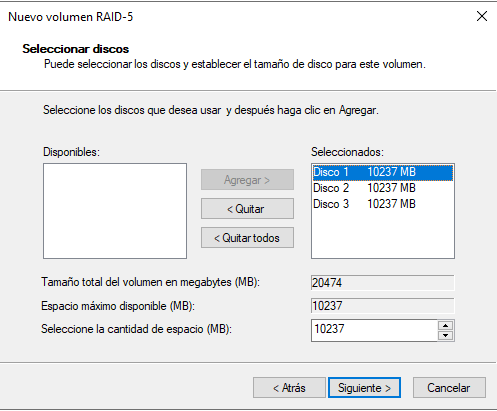

---

**Assignació de lletra i format**

* Assigna una **lletra de la unitat** (ex. E:).
* Dona un **nom** al volum.
* Selecciona el **sistema de fitxers**:
* **NTFS**: Recomanat per a la majoria de casos.
* **ReFS**: (Resilient File System) útil en entorns de servidor. Ofereix integritat automàtica, detecció d’errors i resistència a corrupcions.

> ℹ️ **Nota:** ReFS no és compatible amb totes les versions ni funcions (per exemple, no permet compressió ni encriptació).

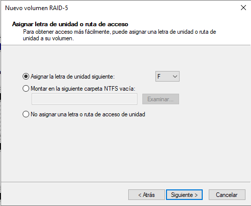
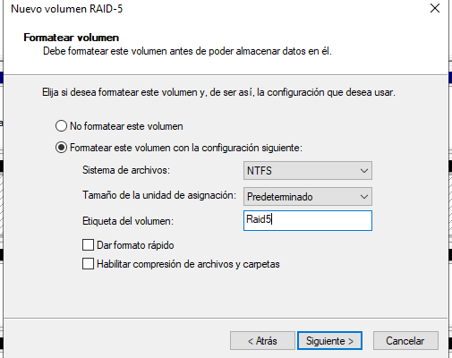

---

**Confirmació i creació**

Un cop revisades les opcions, Windows mostrarà un avís indicant que els discos seran convertits i es perdran dades si n’hi haguessin.

* Fes clic a **"Sí"** per continuar.

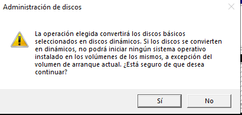

---

**Finalització**

Després d’uns instants, el volum RAID 5 apareixerà com a format i llest per ser utilitzat.

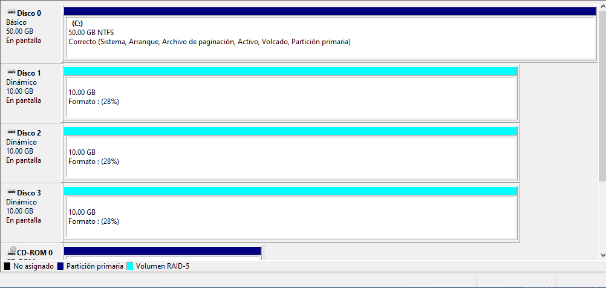

---

## Consideracions finals

* El **RAID 5** proporciona un bon equilibri entre capacitat i seguretat, ja que pot tolerar la fallada d’**un únic disc**.
* El rendiment d’escriptura és lleugerament inferior a RAID 0 o 1, ja que implica càlcul de paritat.
* Es recomana monitoritzar l’estat dels discs i tenir còpies de seguretat addicionals.

---

## Simulació de fallada d’un disc en RAID 5

Una de les funcions principals del **RAID 5** és la seva capacitat de continuar funcionant en cas que un dels discs falli, gràcies al sistema de **paritat distribuïda**. Aquesta simulació mostra com es comporta el sistema davant d'una fallada i com es pot recuperar.

---

### Preparació de dades per a la prova

Primer es creen alguns fitxers dins la unitat RAID 5 per comprovar si es mantenen disponibles durant i després de la fallada.

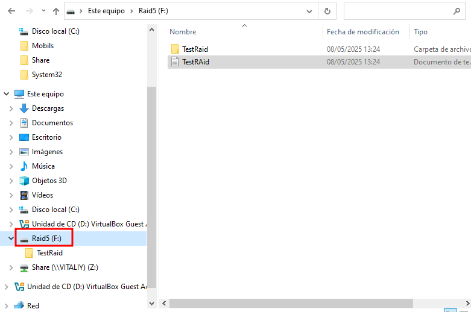

---

**Simulació de la fallada d’un disc**

Amb un clic dret sobre un dels discs (per exemple, **Disc 2**), aquest es desconnecta per simular una fallada física.

El sistema detecta l'error i mostra un **avís de pèrdua de redundància**, però **les dades continuen sent accessibles** gràcies a la informació de paritat.

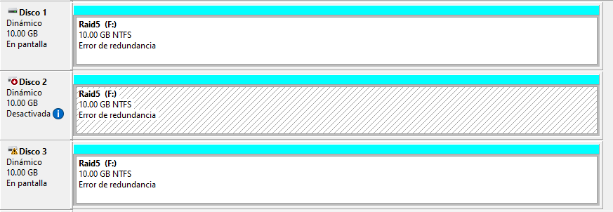

---

**Comprovació del funcionament**

Tot i la fallada, es poden seguir llegint fitxers antics i fins i tot crear-ne de nous dins la mateixa unitat RAID. El sistema continua operatiu.

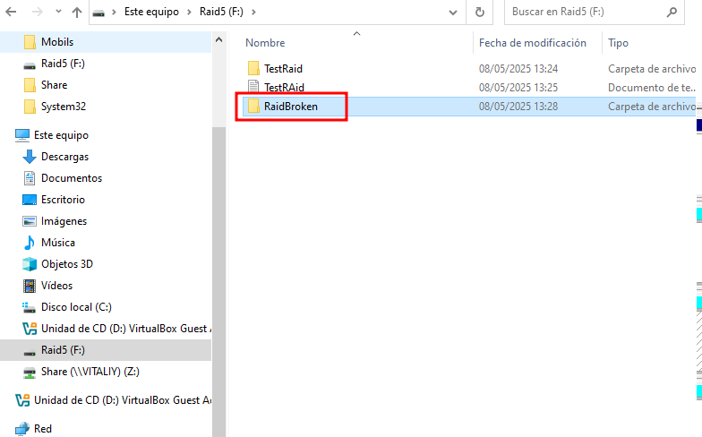

---

**Substitució del disc avariat**

S’afegeix un disc nou al sistema, que substitueix el que ha fallat.

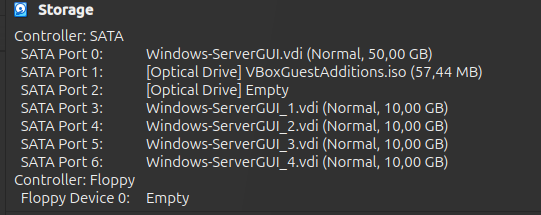

---

### Recuperació del volum RAID

A la Gestió de discs, amb un clic dret sobre un dels discs actius del volum RAID, es selecciona l’opció **"Reactivar RAID"**.

Apareixerà una finestra per seleccionar el nou disc que es vol afegir al volum. En fer-ho, s’inicia el procés de **reconstrucció i sincronització** automàtica de les dades perdudes mitjançant la informació de paritat.

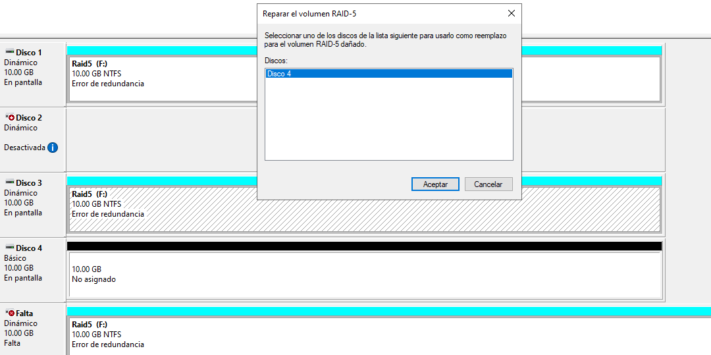

---

**Sincronització i restauració completa**

Durant la sincronització, el sistema regenera les dades al disc nou. Un cop finalitzat el procés, el volum RAID torna a estar **en estat òptim**, amb redundància restaurada i totes les dades intactes.

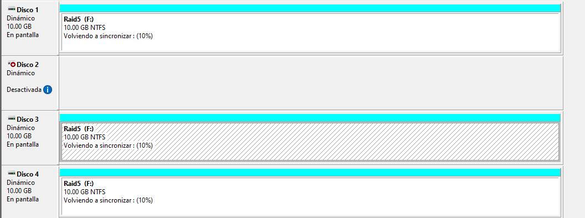

---

**Verificació final**

Es comprova la unitat RAID i es constata que **tots els fitxers originals estan disponibles** i que el sistema ha continuat funcionant sense pèrdua de dades.

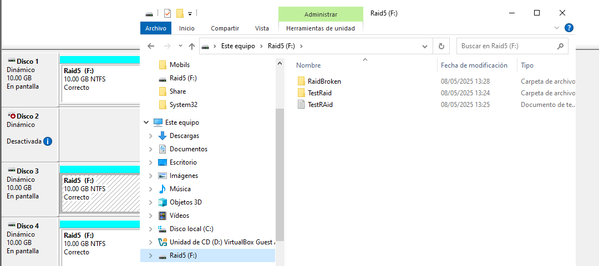

---

