# Unidad 9: Auditories i Monitoratge a Windows

En aquesta pràctica configurarem les directives d'auditoria de Windows per fer un seguiment dels inicis de sessió i l'accés als recursos de xarxa, així com la monitorització del rendiment.

## Configuració de Directives d'Auditoria

Per començar, hem d'accedir a les **Directives de Seguretat Local** per configurar quins esdeveniments volem registrar al sistema.

Dins d'aquest menú, despleguem l'opció de **Directives locals**. Aquesta secció conté les regles bàsiques de seguretat del sistema.

A continuació, anem a la **Directiva d'auditoria**, on podrem definir què volem auditar (inicis de sessió, canvis de privilegis, etc.).

Es recomana utilitzar la **Configuració avançada de la política d'auditoria** per a entorns de servidor, ja que permet un control més precís sobre els esdeveniments registrats.

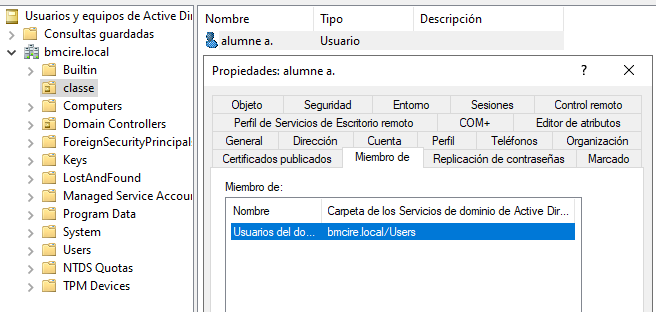

Habilitem l'auditoria per a diferents esdeveniments com els **inicis de sessió** i els **inicis de sessió de compte**. Això registrarà quan els usuaris entren al sistema.

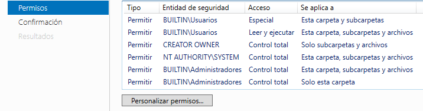

També activem altres directives importants, com l'auditoria d'accés a objectes, el seguiment de processos i l'administració de comptes, assegurant-nos que es registrin tant els èxits com les fallades.

## Preparació de l'Entorn

Per comprovar que les auditories funcionen correctament, preparem un entorn amb un usuari de proves. En aquest cas, utilitzarem l'usuari **alumne**.

Ens assegurem que l'usuari pertany al grup adequat perquè les directives del domini se li apliquin correctament.

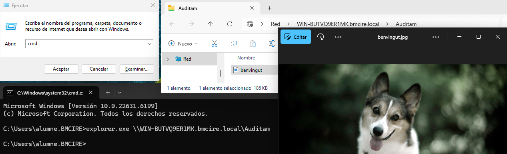

L'usuari executa comandes bàsiques, com obrir la consola de comandes (`cmd.exe`), per generar esdeveniments de seguiment de processos.

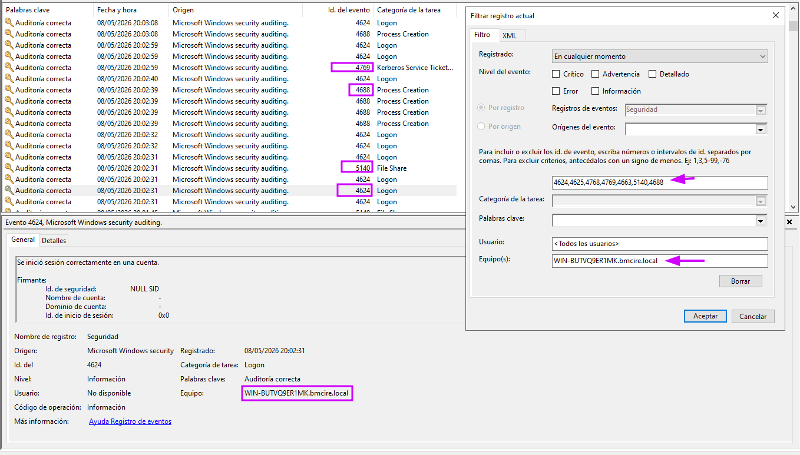

A continuació, l'usuari accedeix a un recurs compartit de xarxa per provocar un esdeveniment d'accés a objectes auditat. Utilitzem la comanda `explorer.exe` cap a la ruta UNC del servidor.

## Comprovació d'Esdeveniments

Després de realitzar aquestes accions, tornem al servidor i obrim el **Visor d'esdeveniments** (`eventvwr.msc`).

Dins de **Registres de Windows > Seguretat**, apliquem filtres per cercar els identificadors (IDs) específics que estem auditant, com el 4624 (inici de sessió exitós) o 4625 (inici fallit).

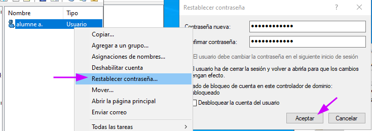

Podem veure els registres generats per l'accés de l'usuari alumne al recurs compartit i l'obertura de processos. Aquests registres inclouen els intents correctes i els accessos als objectes configurats.

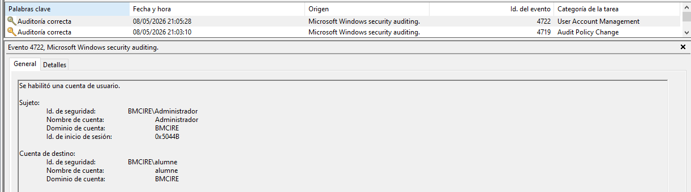
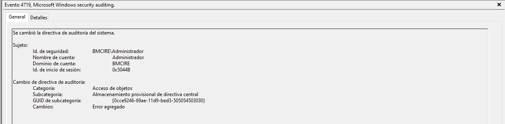

## Monitorització i Rendiment

Finalment, analitzem el rendiment del sistema i l'ús de recursos mitjançant les eines de monitorització de Windows.

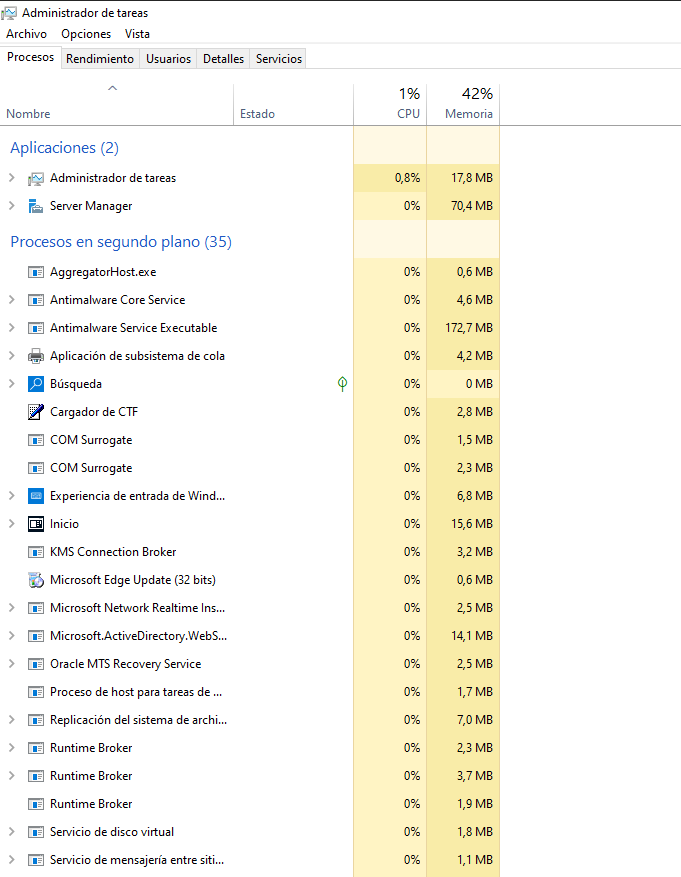

Amb el **Monitor de Rendiment** i el **Gestor de Tasques**, observem la càrrega de la CPU i els processos actius per assegurar-nos que no hi ha colls d'ampolla.

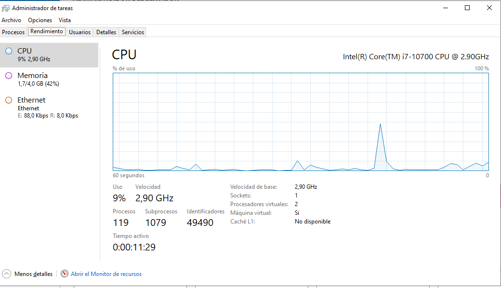
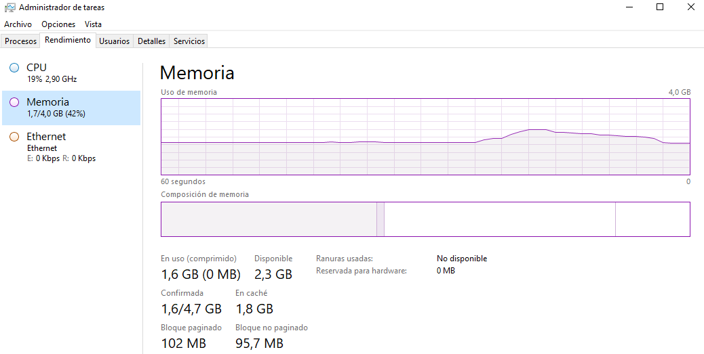
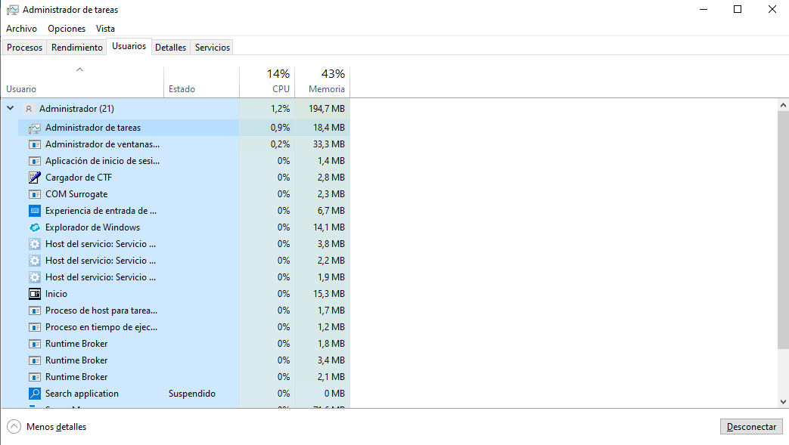

Monitoritzem també el rendiment del disc i de la xarxa, revisant la quantitat de dades llegides i escrites per detectar activitats inusuals.

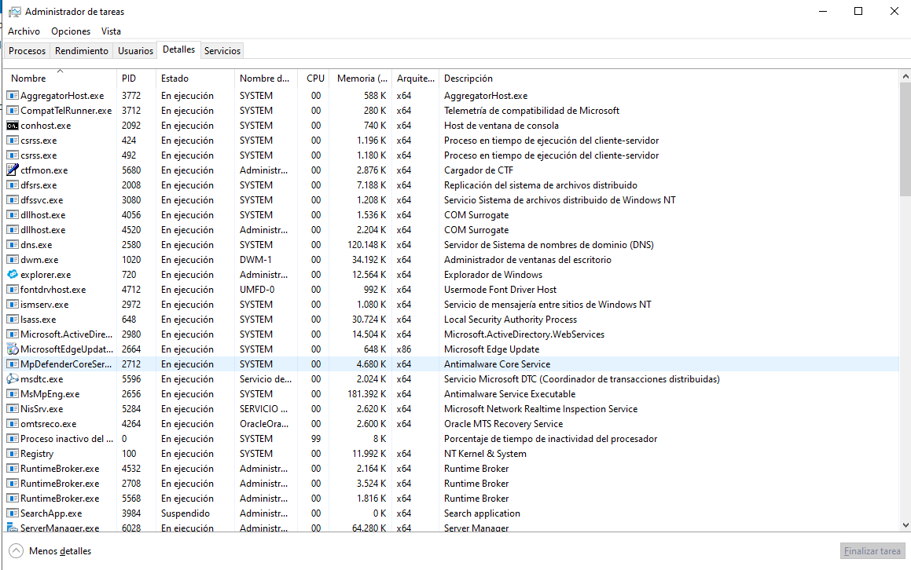
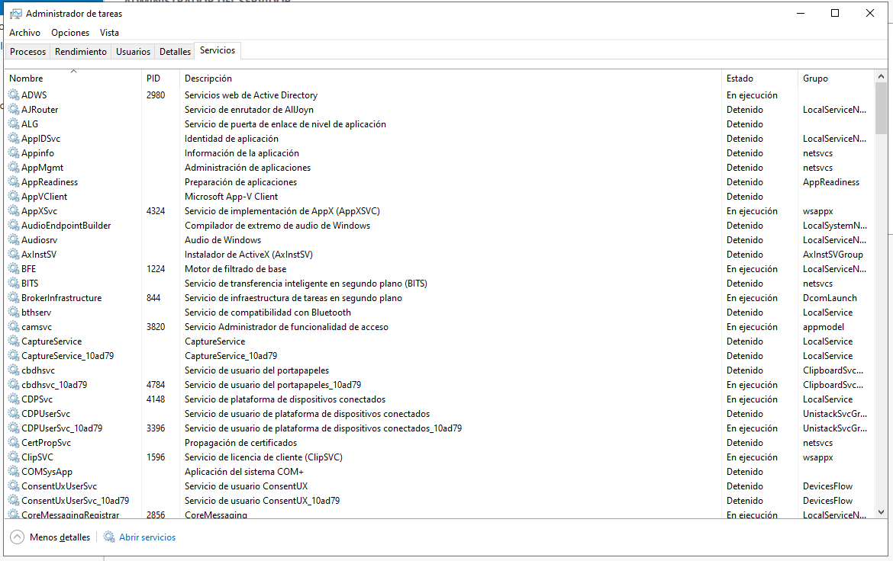
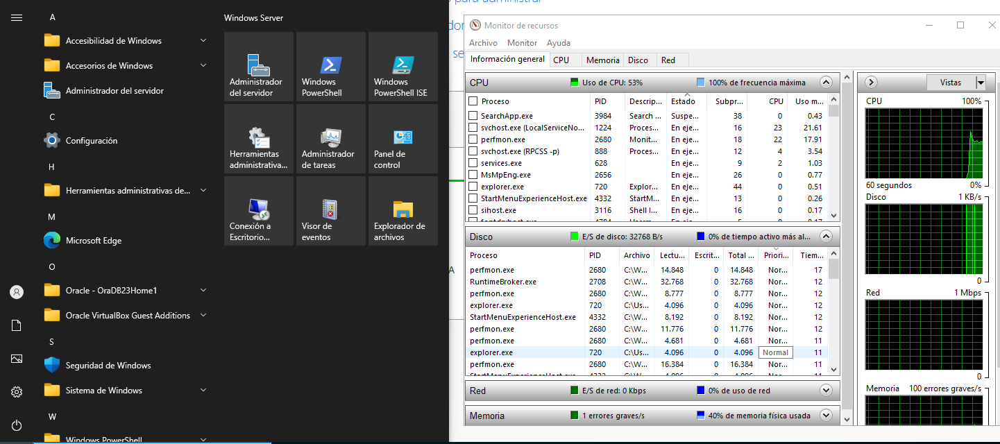

Podem configurar alertes o conjunts de recopiladors de dades per registrar el rendiment durant períodes prolongats de temps.

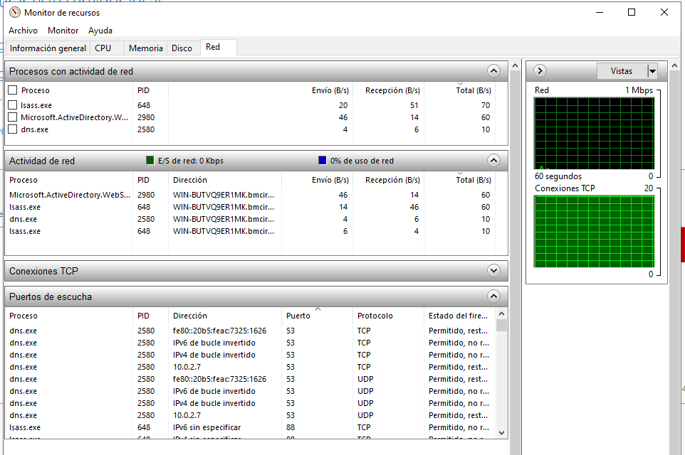
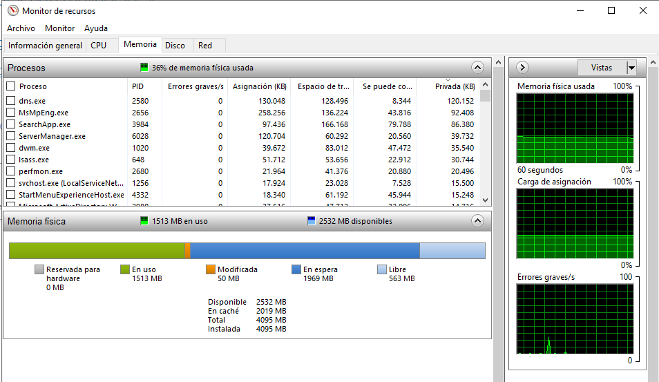

Amb això donem per finalitzada la configuració d'auditories i la monitorització de recursos al servidor.
